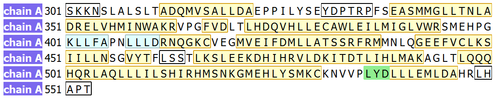
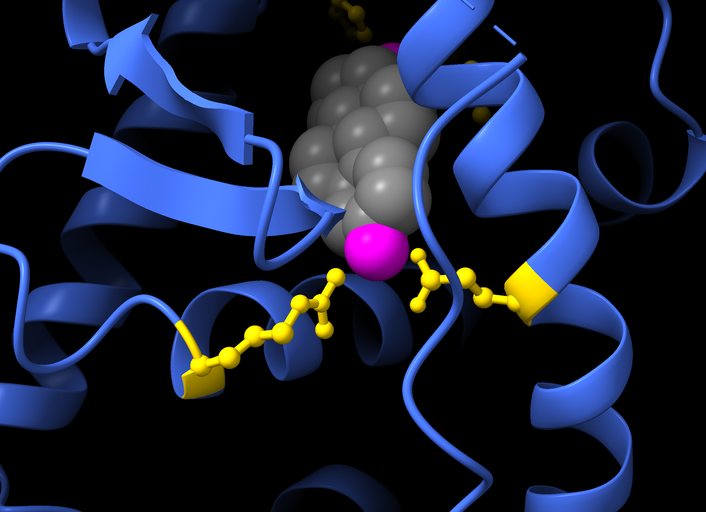
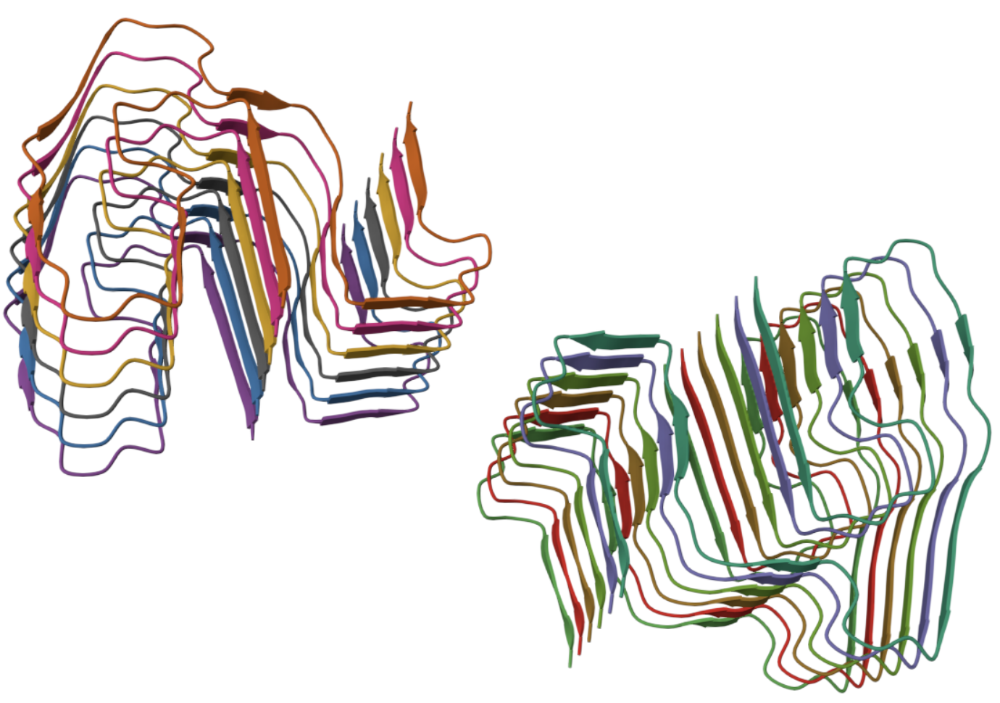

# Structure visualisation with ChimeraX

:::{.callout-tip}
#### Learning objectives

- Familiarise yourself with the ChimeraX interface.
- Load and import solved protein structures.
- Perform basic manipulations: rotate, zoom, colour, and highlight.
- Select residues, chains, and atoms using the selection syntax.
- Save and manage ChimeraX sessions for later use.
:::

## Overview

ChimeraX provides a **graphical user interface (GUI)** and a **command line interface (CLI)**.
You can combine both for flexible and efficient structure visualisation.

## Opening a structure

To open a PDB file from the command line, use `open`. 
For example, to load the ligand-binding domain of the human Estrogen Receptor (PDB: 1ERE):

```bash
open 1ere
```

The structure appears in the main window.
Use the mouse to **rotate**, **zoom**, and **pan**.



## Inspecting the structure

Use the `info` command to obtain information about the loaded models:

```bash
info
```

```output
2 models
#1, 1ere, shown
11376 atoms, 11472 bonds, 1530 residues, 6 chains (A,B,C,D,E,F)
12 missing structure
#1.1, missing structure, shown, 12 pseudobonds
```

- Model **#1**: main structure (11376 atoms, 11472 bonds, 1530 residues, 6 chains).
- Model **#1.1**: missing residues (represented as pseudobonds).

To get details about chains:

```bash
info polymers
```

ChimeraX lists residue ranges for each chain.
For 1ERE, each chain has three segments (305–330, 337–461, 465–548), repeated because this PDB entry consists of three assemblies of a homodimer (so, 3 x 2 = 6 chains).

To view **metadata** such as ligands:

```bash
log metadata
```

|  | Metadata for 1ere#1 |
|----------|-------|
| Title | Human estrogen receptor ligand-binding domain In complex with 17Β-estradiol |
| Citation | Brzozowski, A.M., Pike, A.C., Dauter, Z., Hubbard, R.E., Bonn, T., Engstrom, O., Ohman, L., Greene, G.L., Gustafsson, J.A., Carlquist, M. (1997). Molecular basis of agonism and antagonism in the oestrogen receptor. Nature, 389, 753-758. PMID: 9338790. DOI: 10.1038/39645 |
| Non-standard residue | EST — estradiol |
| Gene source | Homo sapiens (human) |
| Experimental method | X-ray diffraction |
| Resolution | 3.1Å |

For example, this shows the presence of residues named `EST`, corresponding to the Estradiol ligand included with this structure.

To list chains and their UniProt references:

```bash
log chains
```

| Chain | Description       | UniProt            |
| ----- | ----------------- | ------------------ |
| A–F   | Estrogen Receptor | ESR1_HUMAN 301–553 |

## Selecting items

Selections are central in ChimeraX, and can be used to **highlight, manipulate, or modify** specific parts.
Selections are highlighted in the viewer and can be modified or combined.

Selections use a **target specifier syntax** ([docs](https://www.cgl.ucsf.edu/chimerax/docs/user/commands/atomspec.html)), including:

- `#` → model number
- `/` → chain ID (uppercase letters)
- `:` → residue numbers
- `@` → atom names

**Examples:**

- Select **model #1**:

    ```bash
    select #1
    ```

- Select **chain A**:

    ```bash
    select /A
    ```

- Select **residue 500 in chain A**:

    ```bash
    select /A:500
    ```

- Select **alpha carbon of residue 305**:

    ```bash
    select /A:305@CA
    ```

- Select **residues 400–500 in chain A**:

    ```bash
    select /A:400-500
    ```

- Clear selection:

    ```bash
    select clear
    ```

- Select all:

    ```bash
    select all
    ```

### Combining and modifying selections

Selections can be built incrementally with `select add` and `select subtract`.
Examples:

- Select all residues in chain A **except** for residues 400 to 500:

    ```bash
    select /A
    select subtract /A:400-500
    ```

- Add back residues 400 to 410:

    ```bash
    select add /A:400-410
    ```

Selections can be combined using logical operators:

- `&` (AND) 
- `|` (OR)

Examples:

- Select residues 305–330 in either chain A or chain F:

    ```bash
    select /A:305-330 | /F:305-330
    ```

- Select all serine (SER) residues in a range:

    ```bash
    select /A:305-330 & :SER
    ```

In the last example, note how we used the **aminoacid name** (SER) instead of the residue number to select all serine residues in that range.

### Select keywords

There are convenience keywords that can be used to select common groups of atoms:

| Keyword   | What it selects                           |
| --------- | ----------------------------------------- |
| `protein` | all protein atoms                         |
| `nucleic` | all DNA/RNA atoms                         |
| `ligand`  | non-polymer atoms (small molecules, ions) |
| `solvent` | water molecules                           |
| `sel`     | currently selected elements               |

Residues are also annotated with names. 
We've already seen how we can select all serine residues by their name using `:SER`.

Ligands are usually also named.
For example, in our structure, the ligand (estradiol) is annotated with the keyword `EST`, so we can select it with:

```bash
select :EST
```

Alternatively, we could use the generic keyword: 

```bash
select ligand
```

The latter would select every ligand in the loaded structures, so if there was more than one ligand, all of them would be selected this way.

#### Zooming and rotation

Zoom to a selection with `view`:

```bash
select /A:305@CA
view sel
```

Set the centre of rotation on a certain item with `cofr`. 
For example, set the centre of rotation on the ligand: 

```bash
cofr :EST
```

## Delete objects

You can use the `delete` command to remove parts of your struture from view.
In our example, the 1ERE structure contains 6 repeated chains (A-F).
To only keep chain A and delete the rest:

```bash
select #1/A
delete atoms ~sel
```

- First select chain A (`/A`) from the main model (`#1`).
- Then delete everything that is **not** selected: `~sel` (the `~` symbol negates the selection).

The same could have been achieved with:

```bash
delete #1/B-F
```

## Naming and saving selections

Selections can be saved for reuse.

For example, we save a selection of residues that are commonly mutated in cancers ([Fuqua, Gu & Rechoum, 2015](https://doi.org/10.1007/s10549-014-2847-4)):

```bash
select /A:536,537,538
name frozen muts /A:536,537,538
```

Now you can refer to `muts`:

```bash
# zoom-in on this selection
view muts

# select these residues
select muts

# select everything except these residues
select ~muts

# colour these residues red
color muts red
```

## Sequence viewer

Open a sequence window to visualise and select residues:

```bash
sequence chain /A
```



- Click residues in the sequence to select them in 3D.
- Selected residues are highlighted in green.
- Secondary structure is colour-coded: α-helix (yellow), β-strand (blue).
- Missing residues appear in black boxes.

- Residue numbers correspond to the UniProt numbering.
- Selected residues are <mark style="background-color: #b0eb99">highlighted in green</mark>. 
- Secondary structure is colour-coded: <mark style="background-color: #eafeff">β-strand in blue</mark> and <mark style="background-color: #fdffd1">α-helix in yellow</mark>.
- Missing residues appear in black boxes.
  These often correspond to disordered regions or flexible termini that could not be resolved in the protein structure.

## Structural representations

Proteins can be represented visually in different ways. 

- **Cartoon representation** highlights secondary structure:

    ```bash
    hide atoms
    show cartoon
    ```

- **Atomic representation** shows all atoms:

    ```bash
    hide cartoon
    show atoms
    ```

- **Alternate atomic styles** can be used:

    ```bash
    hide cartoon
    show atoms
    style stick
    style sphere
    style ball
    ```

- **Mix representations** can be used. For example, cartoon for protein, spheres for ligand:

    ```bash
    hide atoms
    show cartoon
    show :EST
    style :EST sphere
    ```

- **Colouring example:**

    ```bash
    color protein grey
    color :538-546 yellow
    show :538-546 atoms
    style :538-546 stick
    color muts blue
    color :EST red
    ```

   - Colour the protein grey.
   - Colour residues 538-546 yellow, and show their atoms using a stick style.
   - Colour the `muts` selection blue.
   - Colour the ligand (EST) red.

## Saving sessions and structures

**Save a ChimeraX session** by changing to the destination directory, and use the `save` command: 

```bash
cd ~/Course_Materials/
save 1ERE_annotated.cxs
```

`.cxs` is a ChimeraX-specific format. 
To reopen the session: 

```bash
cd ~/Course_Materials/
open 1ERE_annotated.cxs
```

The `save` command can also be used to **save protein structures in standard formats**:

```bash
save 1ERE_annotated.pdb
save 1ERE_annotated.cif
```

This allows using ChimeraX to convert between struture formats: open a `.pdb` file and save as `.cif`, or vice-versa.

## Exercises

:::{.callout-exercise}
#### Selection commands

Start a new session with the 1ERE structure (Human estrogen receptor):

```bash
close
open 1ere
```

Write the `select` commands to achieve the following:

1. Select all residues from either chain A or chain B.
2. Select everything except chain E.
3. Select all the CA atoms (alpha carbon) on residues 315-350 of chain C.

:::{.callout-answer}

1. We can use the _OR_ (`|`) operator to select the residues in either of those chains: 

    ```bash
    select /A | /B
    ```

2. We can use the `select all` command to select everything, and then subtract chain E:

    ```bash
    select all
    select subtract /E
    ```

3. To select atoms we can use the `@` selector after the residue number:

    ```bash
    select /C:315-350 & @CA
    view sel
    ```
:::
:::


:::{.callout-exercise}
#### Styles and colouring

Start a new session with chain A of 1ERE (Human estrogen receptor):

```bash
close
open 1ere
select #1/A
delete ~sel
select clear
```

Try to recreate the visualisation shown below, where: 

- The protein is shown in cartoon representation using `royalblue` colour.
- The ligand (EST) is shown in sphere style using `grey` colour for carbon atoms and `magenta` for oxygen atoms. 
- The key protein residues for binding the ligand - Glu353, Arg394, His524, Leu525 - are highlighted in `gold` colour and their atoms are shown in ball style.
- Zoom in specifically on these four residues using the `view` command.



:::{.callout-answer}

Here are the steps to recreate this visualisation: 

```bash
hide atoms
show cartoon
color protein royalblue
show :EST atoms
style :EST sphere
color :EST & C grey
color :EST & O magenta
show :353,394,524,525 atoms
style :353,394,524,525 ball
color :353,394,524,525 gold
view :353,394,524,525
```

:::
:::

:::{.callout-exercise}
#### Recreate a view

Try to recreate this view of the murine AA amyloid fibril (PDB: **6DSO**):



:::{.callout-answer}

This gets us close:

```bash
close 
open 6DSO
hide atoms
show cartoon
color bychain
```

The default colour palette doesn't exactly match the colours shown in the image, but we could change the colours of each chain manually if desired. 

:::
:::

## Summary 

:::{.callout-tip}
#### Key points

At first, ChimeraX may look like a graphics program, however its real power comes from its **range of commands and flexible selection syntax**.

- ChimeraX combines a graphical interface and command line interface.
  You can rotate structures with the mouse while using commands for precise control.

- Structures are loaded with the `open` command.
  ChimeraX can fetch structures directly from the PDB using their identifier.

- Structural information can be inspected using `info` commands.
  These commands reveal models, chains, residues, ligands, and experimental metadata.

- Selections are central to structural analysis.
  ChimeraX uses a concise syntax to specify models (`#`), chains (`/`), residues (`:`), and atoms (`@`).

- Selections can be modified and combined.
  Commands such as `add`, `subtract`, `&`, and `|` allow complex queries within a structure.

- Structures can be displayed in different representations.
  Cartoon views emphasise secondary structure, while atom-based views show detailed interactions.

- Named selections help organise analyses.
  Saving selections allows you to refer to important residues or regions later.

- ChimeraX sessions can be saved and reopened.
  This allows you to preserve visualisations and annotations for later work.

- Mastering selection syntax will allow you to:

  - highlight important residues
  - isolate binding pockets
  - compare structures
  - inspect mutation sites
  - visualise interfaces
:::