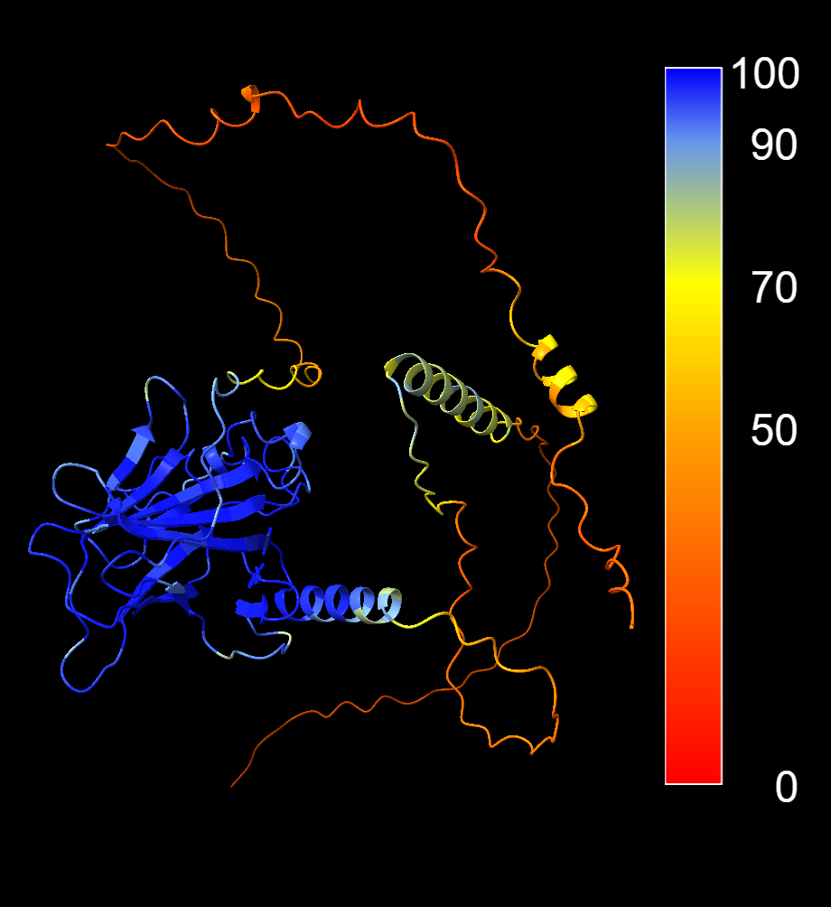
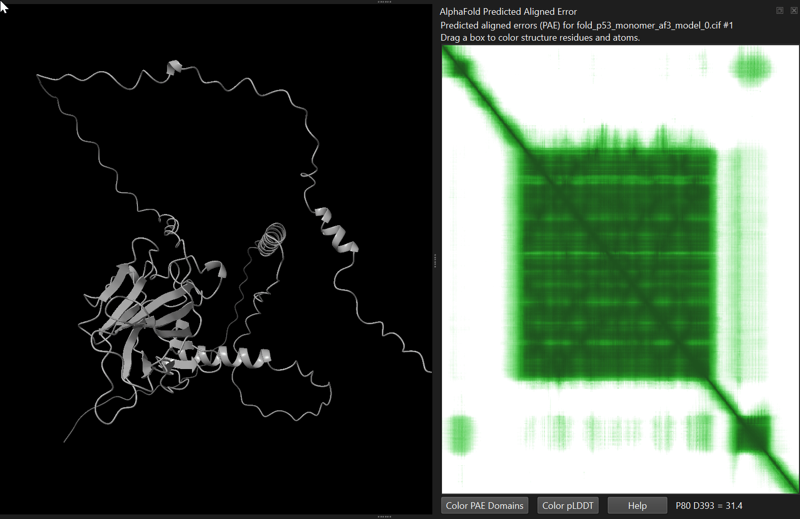
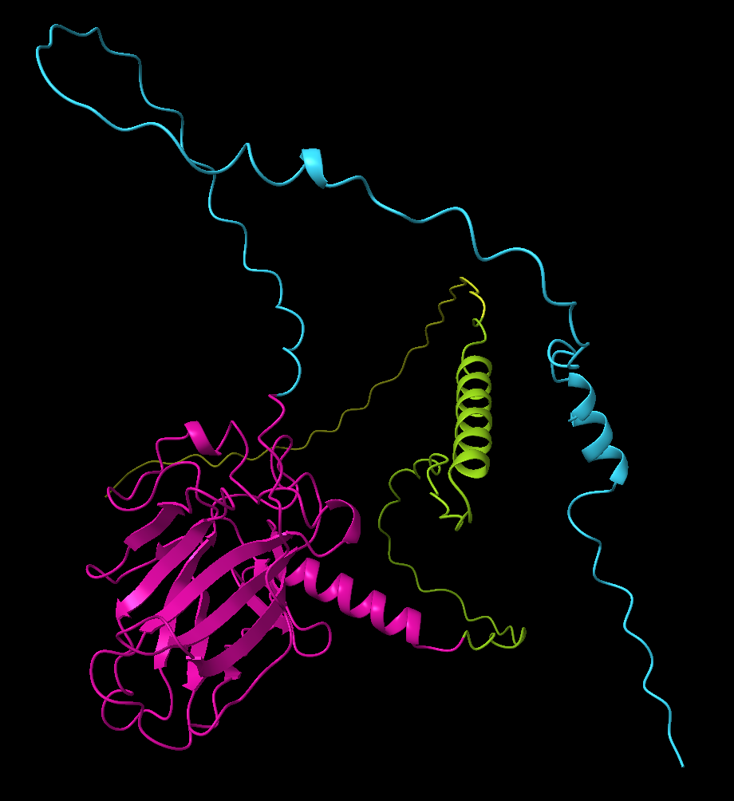

# Monomer structure prediction

::: {.callout-tip}
#### Learning Objectives

- Predict protein structures using **ColabFold (AlphaFold2)** and **AlphaFold Server (AlphaFold3)**.
- Choose appropriate prediction parameters for different biological questions.
- Interpret prediction outputs, including confidence scores and ranking metrics.
- Understand when monomer and multimer prediction are appropriate.
- Visualise and interpret predicted structures using ChimeraX.
:::

## Structure prediction

::: {.panel-tabset group="alphafold"}
### AlphaFold Server (AlphaFold3)

The **AlphaFold Server** provides a web interface for running structure predictions using AlphaFold3.

Compared with AlphaFold2, the newer model can predict more complex systems, including:

- protein monomers
- protein multimers
- protein-DNA complexes
- protein-ligand complexes

For a simple monomer prediction, the workflow is straightforward.

1. Paste the protein sequence.
2. Choose the number of copies (for monomer prediction this is **1**).
3. Submit the job and wait for the prediction to complete.

The server will return the predicted models along with confidence metrics.

### ColabFold (AlphaFold2)

**ColabFold** provides a convenient way to run AlphaFold2 predictions using Google Colab notebooks.

It uses a streamlined pipeline based on the original AlphaFold2 method but replaces the heavy sequence search step with the fast **MMseqs2** search algorithm.
This makes predictions much faster and easier to run on standard hardware.

ColabFold also provides several parameters that allow users to customise their predictions.
These are detailed next.

#### Parameter: `num_relax`

Controls how many predicted models undergo **energy minimisation** using the AMBER force field.
Relaxation improves local geometry but does not change the overall fold.

Typical settings:

- `0` - no relaxation (fastest)
- `1` - relax only the top model (good compromise)
- `5` - relax all models (slowest)

#### Parameter: `template_mode`

Controls whether the model uses **structural templates**.

Options:

- `none` - no templates (pure de novo prediction). Fastest and ideal when no homologous structure exists. 
- `pdb100` - search PDB for structural templates. Improves accuracy if close homologues exist.
- `custom` - user-provided templates

#### Parameter: `msa_mode`

Controls how homologous sequences are collected.

Options:

- `single_sequence` - only the input sequence (very fast; not recommended)
- `mmseqs2_uniref` - search UniRef database (balance of speed and depth)
- `mmseqs2_uniref_env` - include environmental sequences from metagenomic experiments (slower, but can improve accuracy)
- `custom` - user-supplied alignment

In most cases `mmseqs2_uniref_env` provides the best balance between speed and depth.

#### Parameter: `model_type`

Controls which AlphaFold model is used.

The **auto** setting usually works best because it selects the appropriate model based on the input (monomer or multimer).

#### Parameter: `num_recycles`

Controls how many times the model refines its prediction.
During each cycle the predicted structure is fed back into the network, which has been shown to improve model accuracy.

Typical settings:

- `0` - fastest, but not recommended
- `3` - good balance between speed and accuracy
- `6+` - higher accuracy for difficult folds
- `auto` - run until convergence

#### Parameter: `num_seeds`

AlphaFold predictions include stochastic elements.
Different **random seeds** can produce slightly different structures.
Running multiple seeds increases the diversity of predictions.

Typical settings:

- `1` - sufficient for most proteins
- `2+` - useful when exploring uncertain folds

#### Parameter: `use_dropout`

Dropout introduces additional stochasticity into the neural network.
This can generate more diverse predictions, particularly in:

- flexible regions
- uncertain interfaces
- multimer predictions

It is often combined with **multiple seeds** to explore alternative conformations.
:::

## Download results

After a run completes, the results can be downloaded for further analysis. 
The most important outputs are:

**Predicted structures**

- Structure files in **PDB or mmCIF format**.
- Each file contains the predicted atomic coordinates.

**Confidence scores**

- **pLDDT** values stored per residue in the structure file.
- These values indicate the model's confidence in each region.

**PAE matrix**

- A matrix describing the predicted positional error between residue pairs.
- Often visualised as a heatmap.
- These are stored in files with extension `.json`.

**Ranking information**

- AlphaFold typically produces multiple models.
- These models are ranked according to global confidence metrics such as **average pLDDT** or **pTM** (**ipTM** for multimers).
- The ranking is included in the file name.

In practice, one usually examines the **top-ranked model first**, then compare it with alternative predictions.

## Model scores

AlphaFold predictions include several **confidence scores**. 
These scores help us estimate how reliable a predicted structure is.

Broadly, these scores fall into two categories:

- **Global scores** - measure confidence in the overall fold of the protein.
- **Local scores** - measure confidence in specific regions of the structure.

Both are useful, but they answer different questions.
The following table summarises these scores, with details in the following sections:

| Metric | What it measures             | Range         | Interpretation                                                              |
| ------ | ---------------------------- | ------------- | --------------------------------------------------------------------------- |
| pLDDT  | Local per-residue confidence | 0-100         | High = accurate local geometry<br>Low = uncertain or disordered region      |
| PAE    | Pairwise positional error    | angstroms (A) | Low = confident domain relationships<br>High = uncertain domain orientation |
| pTM    | Global fold accuracy         | 0-1           | >0.5 → overall fold likely correct<br><0.5 → unreliable model               |

### Global confidence scores

Global scores describe the reliability of the **overall protein fold**.

#### pTM

The **predicted Template Modelling score (pTM)** estimates how accurate the global structure is expected to be.

The score ranges from **0 to 1**.

Typical interpretation:

| pTM     | Interpretation              |
| ------- | --------------------------- |
| >0.7    | very reliable fold          |
| 0.5-0.7 | likely correct overall fold |
| <0.5    | unreliable prediction       |

This score is particularly useful when comparing **multiple predicted models**.

#### Average pLDDT

Although pLDDT is calculated **per residue**, some tools (such as ColabFold) also report the **average pLDDT** across the entire structure.
This value provides a quick summary of model quality.

Typical interpretation:

| Avg pLDDT | Interpretation                 |
| --------- | ------------------------------ |
| >90       | very high confidence model     |
| 70-90     | good model                     |
| 50-70     | uncertain structure            |
| <50       | likely disordered or incorrect |

However, average values can hide local properties of the prediction.
A model may have a high average pLDDT while still containing **poorly predicted loops or flexible regions**.
Conversely, a model may have low average pLDDT while still containing **confidently predicted domains**. 

### Local confidence scores

Local scores describe confidence **within specific regions of the structure**.
These scores help identify flexible loops, disordered regions, or uncertain domain orientations.

#### pLDDT

The **predicted Local Distance Difference Test (pLDDT)** measures confidence **for each residue**.

Scores range from **0 to 100**.

Typical interpretation:

| pLDDT | Confidence           |
| ----- | -------------------- |
| >90   | very high confidence |
| 70-90 | confident            |
| 50-70 | low confidence       |
| <50   | likely disordered    |

AlphaFold stores pLDDT values in the **B-factor column** of the structure file (`.pdb`/`.cif`). 
ChimeraX can colour residues using this information, as we will see below.

#### PAE

The **Predicted Aligned Error (PAE)** describes the expected positional error between **pairs of residues**.
It is usually shown as a **matrix heatmap**.

This score answers a different question:

> How confident is the model about the _relative positions_ of different parts of the protein?

Here, lower values are better, and typical patterns include:

- **Dark diagonal blocks** → well-defined secondary structures or structural domains
- **Light off-diagonal regions** → uncertain orientation between domains

High PAE between domains often indicates that the domains fold correctly but their **relative orientation is flexible or uncertain**.

:::{.callout-note}
#### How are these scores calculated?

AlphaFold learns to estimate its own prediction confidence during training.

During training:

1. The model learns to predict protein structures from sequence data.
2. Additional components of the network learn to estimate the reliability of those predictions.

The pLDDT, PAE, and pTM scores therefore reflect the model's **internal estimate of accuracy**, based on patterns it learned from many experimentally solved protein structures.
:::

## ChimeraX

The three-dimensional structures predicted by AlphaFold can be loaded into ChimeraX, along with their confidence scores.

First, it is convenient to change the ChimeraX workding directory to where the data is located on the computer.
On our training computers, this is: 

```bash
cd ~/Course_Materials
```

::: {.panel-tabset group="language-choice"}
### AlphaFold Server (AlphaFold3)

AlphaFold Server outputs the structure as a `.cif` file, with the following naming convention:

- The prefix `fold_`
- The name used by the user upon job submission
- The model ranking - `model_[0-5]` - for the five models generated, in order of global confidence score (i.e. model 0 is the highest-confidence model)

We use the `open` command to load the structure into ChimeraX:

```bash
open p53_human/p53_monomer_af3/fold_p53_monomer_af3_model_0.cif
```

### ColabFold (AlphaFold2)

ColabFold outputs the structure as a `.pdb` file, with the following naming convention:

- The name used by the user upon job submission, followed by a job submission string

- An indicator of whether the model is unrelaxed or relaxed (if using `num_relax` option)

- The model ranking - `rank_[001-X]` - for the X models generated, in order of global confidence score (i.e. `rank_001` is the highest-confidence model)

- The model number - `_alphafold2_ptm_model_[1-5]` - corresponding to the five AlphaFold2 neural network models

- The random seed number - `seed_[000-X]`

We use the `open` command to load the structure into ChimeraX:

```bash
open p53_human/p53_monomer_af2/p53_monomer_af2_7c637_unrelaxed_rank_001_alphafold2_ptm_model_1_seed_000.pdb
```

:::

Once loaded, the structure appears in the main viewer.

### Colouring by confidence score

AlphaFold stores **pLDDT values** in the **B-factor column** of the structure file.
The B-factor field normally stores atomic temperature factors in experimental structures. 
AlphaFold repurposes this field to store confidence values.

To colour residues by confidence:

```bash
colour bfactor palette alphafold key true
```

{width=50%}

This applies the standard AlphaFold colour scheme:

- **Blue** - very high confidence
- **Cyan** - confident
- **Yellow** - low confidence
- **Orange/red** - very low confidence

Regions coloured yellow or red often correspond to:

- flexible loops
- disordered regions
- poorly constrained predictions

The `key true` option opens a menu to set a legend, but can be left out if you prefer.

### Viewing the PAE matrix

The **Predicted Aligned Error (PAE)** describes the expected positional error between pairs of residues.
Lower values indicate higher confidence in the relative positions of those residues.

The PAE matrix is stored in a text-based format called `.json`, following a naming convention matching the corresponding structure file.  
To load the PAE matrix in ChimeraX:

::: {.panel-tabset group="language-choice"}
### AlphaFold Server (AlphaFold3)

```bash
alphafold pae #1 palette paegreen file p53_human/p53_monomer_af3/fold_p53_monomer_af3_full_data_0.json
```

### ColabFold (AlphaFold2)

```bash
alphafold pae #1 palette paegreen file p53_human/p53_monomer_af2/p53_monomer_af2_7c637_scores_rank_001_alphafold2_ptm_model_1_seed_000.json
```

:::

ChimeraX will display the matrix as a heatmap.
You can interactively select blocks on the heatmap, which will get highlighted in the structure. 

{width=50% fig-align="center"}

You can also ask ChimeraX to **automatically identify potential structural domains** based on the PAE matrix.
Either by clicking the "Color PAE Domains" in the PAE menu, or by running the following command:

```bash
alphafold pae #1 colorDomains true
```

This command analyses the PAE matrix and groups residues into **coherent domains** - regions where the model predicts low relative positional error. 
ChimeraX then colours each domain with a different colour in the structure.

{width=50% fig-align="center"}

This can be very useful when analysing large proteins, especially when domain boundaries are not known in advance. 
In many cases the automatically identified domains correspond closely to **independently folded structural units**.

ChimeraX also stores the domain assignments as an attribute (`pae_domain`). 
You can use this attribute to select or recolour individual domains later if needed.

## Exercises

You are studying the evolution of the **estrogen receptor (ER)**, a nuclear hormone receptor that regulates gene expression in response to estrogen binding. 
This is a well-studied protein, with important roles in the development of sexual characteristics and in diseases such as breast cancer.

In humans, two genes encode estrogen receptors: _ESR1_ and _ESR2_. 
These proteins contain several well-characterised domains, including a DNA-binding domain (DBD) that recognises specific DNA sequences known as estrogen response elements (EREs), and a ligand-binding domain (LBD) that binds estrogen and other ligands.

ER proteins function as dimers and regulate transcription by binding DNA and recruiting transcriptional machinery.

](https://ars.els-cdn.com/content/image/1-s2.0-S1876162319300112-f03-04-9780128155615_lrg.jpg)

The structure of the human ERα ligand-binding domain has been resolved experimentally (for example PDB 1ERE). 
In this exercise series, you will compare this experimentally determined structure with predicted structures from an evolutionarily distant species.

Based on [Baker et al. (2015)](https://doi.org/10.1016/j.jsbmb.2014.10.020), the most basal lineage known to contain estrogen receptor proteins is the cephalochordate amphioxus (genus _Branchiostoma_), an invertebrate chordate that diverged before vertebrates. 
Studying the ER from amphioxus provides an opportunity to explore how conserved the structure of this protein is across deep evolutionary time.
For example, the ligand binding domain is only around 35% identical at the sequence level compared to human.


:::{.callout-exercise}
#### Sequence retrieval

Open <a href="https://www.uniprot.org/uniprotkb/B3V8B7/entry" target="_blank">UniProt entry **B3V8B7**</a>, which contains the known information for a ER protein in the species _Branchiostoma floridae_.

Questions: 

1. Examine the AlphaFoldDB structure prediction. What is your assessment of the quality of this prediction?

   - Click the link to the AlphaFoldDB entry, where you can also examine the PAE matrix.

3. Can you find the sequence for the ligand-binding domain (LBD) and the DNA-binding domain (DBD)?

:::{.callout-answer}

1. Examining the [AlphaFoldDB entry for B3V8B7](https://alphafold.ebi.ac.uk/entry/B3V8B7), we can observe that:

   - The overall confidence of the model is relatively low, with an average pLDDT = 54.25.
   - However, two regions have substantially higher confidence (pLDDT > 70), suggesting the presence of well-structured domains.
   - These regions likely correspond to the DNA-binding domain (DBD) and the ligand-binding domain (LBD).
   - The PAE matrix shows low error within these regions but high error between them, indicating that the internal structure of each domain is predicted with confidence, while the relative orientation of the domains is uncertain.
   - Regions with low pLDDT likely correspond to flexible or intrinsically disordered regions.



2. On the UniProt page, under **"Family & Domains"**, we can find several annotations:

   - Disordered regions, which are consistent with the low pLDDT regions observed in the AlphaFold prediction.
   - A nuclear receptor DNA-binding domain located at residues **294-370**.
   - A ligand-binding domain (LBD) located at residues **441-682**.

   Returning to the AlphaFoldDB entry, highlighting these residue intervals confirms that they correspond to regions with higher pLDDT scores.
:::
:::

:::{.callout-exercise}
#### Structure prediction with AlphaFold3 (AlphaFold Server)

The predicted protein structure on AlphaFoldDB was generated using AlphaFold2. 
We will investigate whether the prediction improves using AlphaFold3.

Submit the ER protein sequence from _Branchiostoma floridae_ to the <a href="https://alphafoldserver.com" target="_blank">AlphaFold Server (AlphaFold3)</a> to predict its structure.

- <a href="https://rest.uniprot.org/uniprotkb/B3V8B7.fasta" target="_blank">Link to sequence</a>

**Questions:**

1. What is your assessment of the confidence of the model?
2. How does this prediction compare with the AlphaFoldDB (AlphaFold2) model?
3. What strategy would you use for further structural analysis of this protein?

:::{.callout-answer}

1. The prediction has a pTM = 0.38, indicating low overall confidence in the global arrangement of the protein. 
   However, several regions have high pLDDT scores, suggesting that individual domains - particularly the DNA-binding domain and ligand-binding domain - are predicted with good local confidence.

2. Visual comparison suggests that the AlphaFold3 prediction is broadly similar to the AlphaFold2 model from AlphaFoldDB. 
   Both models show well-defined domains connected by low-confidence regions. 
   The overall confidence remains low because large parts of the protein appear to be flexible or intrinsically disordered.

3. A sensible next step would be to focus on the structured domains rather than the full-length protein. 
   For example, the DNA-binding domain and ligand-binding domain could be analysed separately or compared with experimentally determined structures of homologous proteins.
:::
:::

:::{.callout-exercise}
#### Structure prediction with AlphaFold2 (ColabFold)

ColabFold is a user-friendly implementation of AlphaFold2 that runs on Google Colab. 
You can access it at <a href="https://colab.research.google.com/github/sokrypton/ColabFold/blob/main/AlphaFold2.ipynb" target="_blank">this Colab notebook</a>.

As running predictions with the free ColabFold can take some time, for this exercise, we will explore pre-processed results from previous runs:

- [Run 1](https://colab.research.google.com/drive/1yWi3xDWQ7Vk7Uoz1mRBFTnuZ3NFQtl8J?usp=sharing) - used default settings
- [Run 2](https://colab.research.google.com/drive/1hSzm1NeXSlsXCEyyqAmnQNjrFR5lCj9T?usp=sharing) - changed `num_relax`, `template_mode`, `num_recycles` and `num_seeds`

These predictions focused on the LBD domain of the ER from _Branchiostoma floridae_, which is annotated as residues 441-682 on UniProt B3V8B7.
To ensure the full domain was included, a few flanking residues were included in the prediction (residues 420-705):

```
NSFDSDGDSSTGRELRTASHQRLKALIDALDVKEGEHRGEENHPTGQQA
GNWQEISNPELIESVSSLVDRELTGIICWGKKIPGYSKLSLNDQVLLME
STWLDLLILDLVWCSIRHKGEKLLLSGGVLVNRNTISNRRNNSSGDDME
VLEMCDQILSIATKFYEFDLQRREYLCLKAITLVHGSLKGLESDTQVRQ
LQDDLTDALMDVCSERHALGSRRPAKMLLLLSHLRQVSARASSHLGAVR
NGLKVPLYDILLDILTDQVSEGQRDQQAGHHEVASSPEKER
```

**Questions:**

1. Identify the parameter values that changed between the two runs. 
2. Based on the quality scores for both predictions (pLDDT, PAE and pTM), which do you think gives best results?
3. Compare the graphs with **"Predicted LDDT per position"** and **"Sequence coverage"** to assess why some regions have low pLDDT.
4. Open the top-ranked model from run 1 in ChimeraX and explore the confidence scores and PAE matrix.

:::{.callout-answer}

1. Run 1 used default settings, while run 2 used the following: 

   - `num_relax = 1` → relax only the top-ranked model
   - `template_mode = pdb100` → uses the PDB100 database to find structural templates based on sequence similarity
   - `num_recycles = 6` → increase the number of recycling iterations, which can help with model accuracy
   - `num_seeds = 4` → to generate a few models from different random seeds, and choose the one with highest quality

2. The top-ranking predictions of each run had:

   - Run 1 (`rank_001_alphafold2_ptm_model_2_seed_000`): pLDDT = 73.6; pTM = 0.75
   - Run 2 (`rank_001_alphafold2_ptm_model_2_seed_002`): pLDDT = 74.3; pTM = 0.756

These are both very similar, but run 2 has slightly higher confidence scores, suggesting it may be the better prediction.

3. The **"Sequence coverage"** plot shows the multiple sequence alignment between our protein and other proteins in the database. 
   There are several observations we can make:
   
   - In general, regions where the alignment coverage is higher, also correspond to regions with higher pLDDT. 
     This makes sense, as the model is more confident where it found more homologous sequences in the database (i.e., more similar to the training data used in the deep learning model). 
   - The terminal regions of the sequence we used have very low coverage. 
     We decided to include flanking regions to the LBD annotated on UniProt to ensure the full domain was included in our analysis. 
     This plot suggests that these flanking regions are less well conserved in evolutionary terms. 
   - Even within the LBD region there is a "dip" in the alignment coverage at around residue 130, with a corresponding dip in pLDDT to around 60. 
     Looking at the 3D structure, this corresponds to a hinge between two helices, which seems to have lower alignment coverage and also lower pLDDT. 
   - The alignment coverage on the N-terminal side of this "dip" is also higher than the coverage on the C-terminal side, which also suggests different sequence conservation along the LBD sequence. 

4. We can open the model in ChimeraX with the following commands:

    ```bash
    close
    cd ~/Course_Materials/er_amphioxus/lbd_monomer_af2_run1/
    open er_amphioxus_lbd_monomer_af2_run1_a80a1_unrelaxed_rank_001_alphafold2_ptm_model_2_seed_000.pdb
    colour byattribute bfactor palette alphafold
    alphafold pae #1 palette paegreen file er_amphioxus_full_monomer_af2_run1_a80a1_scores_rank_001_alphafold2_ptm_model_2_seed_000.json
    ```

   - We initiate a fresh session using `close`.
   - We navigate to the folder where the results are stored using `cd`.
   - We open the top-ranked model (`.pdb` format) using `open`.
   - We colour the structure by pLDDT score using `colour byattribute bfactor palette alphafold`.
   - We open the PAE matrix using `alphafold pae` and colour it with a green palette.
:::
:::

## Summary

::: {.callout-tip}
#### Key Points

- Predicted models must be evaluated critically, even when produced by advanced methods.
- Structure prediction tools such as AlphaFold provide confidence metrics that should always be examined when interpreting predicted models.
- Global scores (such as pTM) reflect confidence in the overall structure, while local scores (pLDDT) reflect confidence in specific regions.
- Large proteins with flexible or intrinsically disordered regions often have lower global confidence scores.
- AlphaFold confidence scores (pLDDT) help identify regions of a protein that are likely to be well structured versus flexible or disordered.
- The Predicted Aligned Error (PAE) matrix indicates how confidently AlphaFold predicts the relative positioning of different regions of a protein.
- Multidomain proteins often contain well-predicted domains connected by flexible regions with lower confidence.
  - Example: In the ER case study, the DNA-binding and ligand-binding domains appear as high-confidence regions, while other parts of the protein show low confidence consistent with flexible regions.
- Predicting individual domains can sometimes yield more reliable models than predicting the entire protein.

**Foundational AlphaFold papers**

- Jumper et al. (2021) Highly accurate protein structure prediction with AlphaFold.
  [https://doi.org/10.1038/s41586-021-03819-2](https://doi.org/10.1038/s41586-021-03819-2)

- Abramson et al. (2024) Accurate structure prediction of biomolecular interactions with AlphaFold3.
  [https://doi.org/10.1038/s41586-024-07487-w](https://doi.org/10.1038/s41586-024-07487-w)

**Accessible explainers**

- Illustrated AlphaFold
  [https://elanapearl.github.io/blog/2024/the-illustrated-alphafold/](https://elanapearl.github.io/blog/2024/the-illustrated-alphafold/)

- AlphaFold2 is here: what's behind the structure prediction miracle?
  [https://www.blopig.com/blog/2021/07/alphafold-2-is-here-whats-behind-the-structure-prediction-miracle/](https://www.blopig.com/blog/2021/07/alphafold-2-is-here-whats-behind-the-structure-prediction-miracle/)
:::
