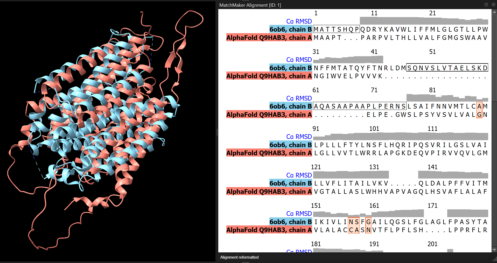
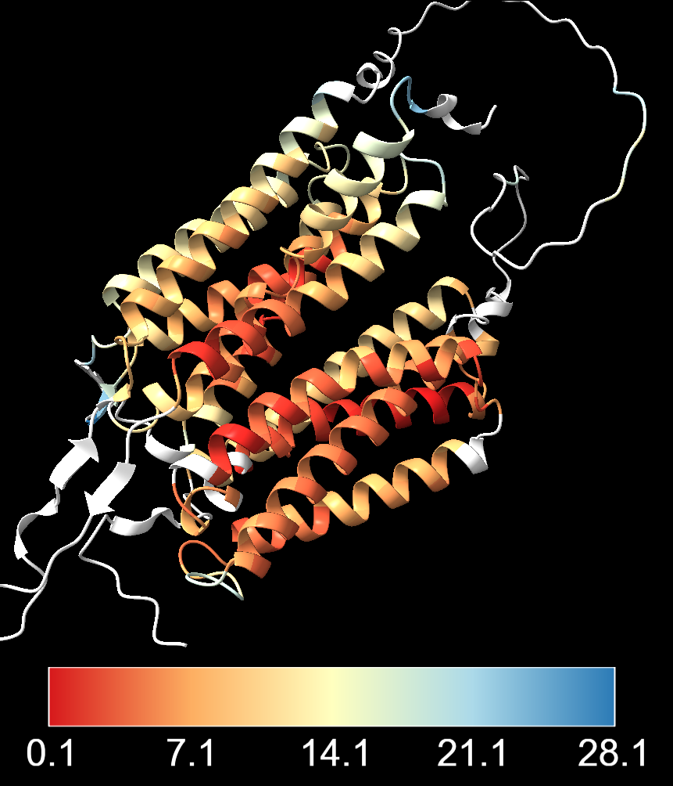
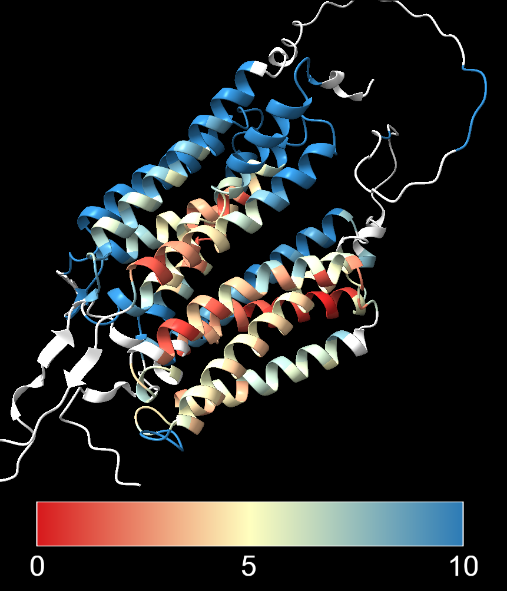
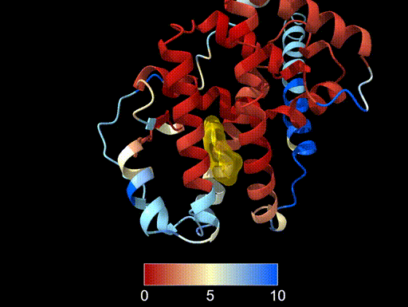

# Comparing protein structures

:::{.callout-tip}
#### Learning objectives

- Align protein structures using structural alignment tools such as MatchMaker.
- Compare predicted models with experimentally solved structures.
- Interpret structural differences using RMSD-based colouring.
- Recognise when global alignments fail for multidomain proteins.
- Evaluate the consistency of multiple AlphaFold predictions.
- Identify conserved structural features across species.
:::

## Overview

Predicting a protein structure is only the first step.
We must also ask an important question:

**How reliable is this model?**

One useful approach is **structural comparison**. 
By aligning a predicted structure with other models or experimentally solved structures, we can:

- evaluate whether the predicted fold is plausible
- identify conserved structural regions
- detect flexible or uncertain parts of the protein

In this section we will explore several common comparison scenarios:

- compare a predicted structure with **homologous experimental structures**
- compare predictions from **different AlphaFold versions**
- compare **multiple predictions of the same protein**
- interpret structural differences using **RMSD colouring**

## Example protein: SLC52A2

We will begin with a human protein called **SLC52A2** (UniProt ID: **Q9HAB3**).

SLC52A2 is a **membrane transporter for vitamin B2 (riboflavin)**.
Mutations in this protein can cause a childhood-onset neurological disorder called **Brown-Vialetto-Van Laere syndrome**.

Many of these mutations reduce protein expression, or riboflavin transport activity.
At present, **no experimentally determined structure** exists for the human protein.
This makes it a good example for exploring how predicted structures can be evaluated using structural comparisons.

First, we load the AlphaFold prediction from AlphaFoldDB:

```bash
close
alphafold fetch Q9HAB3 version 6
hide atoms
color #1 salmon
```

## Searching for homologous structures

Even when a protein has no solved structure, **related proteins may have been crystallised**.
If a homologous structure exists, we can align it to our model and examine how well the folds match.

Two web-based tools for comparing protein structures are:

- **DALI** - high-sensitivity method of structure alignment ([Holm et al. 2023](https://onlinelibrary.wiley.com/doi/abs/10.1002/pro.4519))
- **FoldSeek** - rapid structure search at proteome scale ([van Kempen et al. 2024](https://www.nature.com/articles/s41587-023-01773-0))

Both of these tools allow searching structural databases using the three-dimensional fold rather than sequence similarity alone.

### FoldSeek

FoldSeek can be accessed:

- Through the <a href="https://search.foldseek.com/search" target="_blank">**FoldSeek web server**</a>
- Directly within ChimeraX: `Tools > Structure Comparison > FoldSeek`

After submiting a PDB file, FoldSeek will return a ranked list of similar structures against several of its databases. 
For experimentally-resolved structures, the most relevant database is the **PDB100**.

The results table includes:

- **Target:** The PDB ID of each hit, with a suffix indicating the assembly and specific chain. E.g. `6ob6-assembly1_A` refers to chain A of the first assembly in PDB entry 6OB6.
- **Description:** A short description of the hit, often including the protein name.
- **Scientific name:** The species from which the structure was derived.
- **Prob:** The probability that the hit is a true structural homologue.
- **Seq. Id.:** The identity between the aligned sequences of the hit and the query.
- **E-Value:** The expectation value for the hit, indicating the significance of the match. Lower E-values indicate more significant matches.
- **Position in query:** A schematic representation of the range of residues in the query structure that align with the hit.
- **Alignment:** Clicking this button will display the sequence alignment between the query and the hit, along with a superposition of the two structures.

The top hits often include structures with similar folds, even if their sequences are very different.
For example, one of the top hits for SLC52A2 the Human equilibrative nucleoside transporter-1 (PDB **6OB6**), which shares only ~12% sequence identity with SLC52A2.

The structural alignment provides two scores: 

- **TM-score:** A measure of structural similarity that is independent of protein length. Scores above 0.5 generally indicate similar folds.
- **RMSD:** The root mean square deviation of atomic positions after superposition. Lower RMSD values indicate better structural agreement.

:::{.callout-note}
#### Redundancy-filtered PDB lists

You may often see references to "PDB25", "PDB50", "PDB90" or "PDB100" in the results of database searching tools such as FoldSeek and DALI.

These refer to different versions of the Protein Data Bank (PDB) that have been filtered to remove redundant structures based on sequence similarity.

- **PDB25** - contains only one representative structure for each cluster of sequences with >25% identity. This is a highly non-redundant set, useful for identifying distant homologues.
- **PDB50** - contains one representative for each cluster of sequences with >50% identity. This is a moderately non-redundant set, useful for general searches.
- **PDB90** - contains one representative for each cluster of sequences with >90% identity. This is a less redundant set, useful for finding closely related structures.
- **PDB100** - contains all structures in the PDB, only removing chains that are 100% identical. This is the most comprehensive set, but may include many similar structures.
:::

### DALI

DALI can be accessed from the <a href="http://ekhidna2.biocenter.helsinki.fi/dali/" target="_blank">DALI web server</a>.
Click on "PDB Search" and upload your structure file to search for similar folds in the PDB.

The results will often be similar to FoldSeek, although the ranking of hits may differ due to differences in the underlying algorithms.

One the job completes, you can choose to view the results from against different redundancy-filtered versions of the PDB (see information box above). 
DALI provides three target lists: PDB25, PDB50 and PDB90. 
Lower numbers remove more redundancy and highlight more distant structural relationships.
You can also view the results against the full PDB, which may include more redundant structures.

The results table includes:

- **Chain:** The PDB ID and chain of the hit structure. E.g. `6OB6-A` refers to chain A of PDB entry 6OB6.
- **Z:** A Z-score indicating the significance of the structural match. Higher Z-scores indicate more significant matches, with scores above 2 generally considered significant.
- **rmsd:** The root mean square deviation of atomic positions after superposition. Lower RMSD values indicate better structural agreement.
- **lali:** The number of aligned residues between the query and the hit.
- **nres:** The total number of residues in the hit structure.
- **%id:** The percentage of identical residues in the aligned region between the query and the hit.
- **PDB:** A link to the PDB structure.
- **Description:** A brief description of the hit structure.

You can select a hit and click:

- **Structural Alignment** to view the sequence alignment
- **3D Superposition** to view the 3D alignment of the two structures

:::{.callout-warning}
#### DALI server security and stability

The DALI server currently **only supports HTTP** (rather than HTTPS), which may cause security warnings in modern browsers.
Although unlikely, data transferred over HTTP could potentially be intercepted by third parties.
If you encounter security warnings, you can usually proceed, however, be cautious if you are working with sensitive data.

We have also sometimes found the **DALI server to be unstable**, with long wait times or failed jobs.
You may experience a "Connection has timed out" error after submitting a job. 
We have found that **refreshing the results page** after a while will often reveal the results. 
:::

## Structural alignment with MatchMaker

Once we have identified a homologous structure, we can perform a structural alignment in ChimeraX to compare the folds in more detail.

As an example, consider one of the top FoldSeek hits for SLC52A2: **6OB6**.
We can import this structure into the session:

```bash
open 6ob6
label delete
hide atoms
```

Before aligning structures, it is helpful to check the models and chains present in the session:

```bash
info chains
```

```
chain id #1/A chain_id A
chain id #2/A chain_id A
chain id #2/B chain_id B
```

Here we see that:

- the **AlphaFold model** is stored in **model #1**
- the **PDB structure** is stored in **model #2**
- the experimental structure contains **two chains (A and B)**

We are now ready to perform a structural alignment.

ChimeraX provides the **MatchMaker (`mm`)** command for structural alignment.

```bash
mm #1 to #2 showAlignment true
```

This command:

- aligns model **#1** (the predicted structure) to model **#2** (the experimental structure)
- displays the **sequence alignment** in the Sequence Viewer

Structural alignment works by finding the best superposition of corresponding residues between two structures.

Because the alignment only involves **chain B**, we hide the other chain to simplify the view:

```bash
cartoon hide #2/A
```

This allows us to focus on the comparison between the predicted model and the experimental structure.

{width=50% fig-align="center"}

## Visualising structural differences

After the alignment, ChimeraX calculates several useful attributes, including **per-residue RMSD values**.
The attribute `seq_rmsd` stores the RMSD for each aligned residue.

RMSD measures **how far corresponding atoms are apart** after structural superposition.
Small RMSD values indicate strong agreement between structures.

We can colour the predicted model according to this attribute (we hide the experimental structure to make the colouring easier to see):

```bash
color #1 white
color byattribute r:seq_rmsd #1 target csab palette RdYlBu key true
cartoon hide #2
```

This produces a colour gradient showing structural agreement:

- **Red** - smaller deviation, strong structural agreement
- **Yellow** - intermediate values
- **Blue** - larger structural differences

{width=50% fig-align="center"}

One important thing to note is the choice of colour scale breaks. 
Above, the breaks between colours are automatically set by ChimeraX based on the distribution of RMSD values.
This can sometimes lead to a colour scheme that is dominated by a few outliers with very high RMSD values, making it difficult to see the variation in the rest of the structure.
It may also give the impression that most of the structure has very high agreement, when in fact several of the residues have intermediate or even high RMSD values.

An alternative approach is to set the colour breaks manually, using the graphical user interface **"Tools → Structure Analysis → Render/Select by Attribute"**:

- Choose: “Attributes of residues”
- Choose: “Attribute: seq_rmsd”
- Adjust colouring thresholds using the sliding bars on the histogram of RMSD values

The image below shows the same alignment with:

- Lower threshold (red) set to 0 Å, indicating perfect agreement
- Midpoint (yellow) set to 5 Å, which would indicate some deviation from the reference structure
- Upper threshold (blue) set to 10 Å, meaning that anything above that value will be coloured blue

{width=50% fig-align="center"}

## Exercises

**Reminder:** 
In this exercise series you are investigating the structure of the amphioxus estrogen receptor and comparing it with experimentally determined human ER structures. 

:::{.callout-exercise}
#### Comparing two model predictions

In the [monomer prediction exercises](04-monomer.md), we predicted the structure of the full amphioxus ER protein using AlphaFold3. 
We will now align and compare this model with the prediction available in AlphaFoldDB, which was generated using AlphaFold2.

Run the following code in ChimeraX to open and align the two models:

```bash
close
cd ~/Course_Materials/er_amphioxus/full_monomer_af3
open fold_er_amphioxus_full_monomer_af3_model_0.cif
alphafold fetch B3V8B7 version 6
color #2 steelblue
mm #2 to #1
```

**Questions:**

1. What do you observe about the alignment of the two models?
   - Consider both the agreement within individual domains and the relative orientation of the domains.
   - Focus in particular on the DNA-binding (294-370) and ligand-binding (441-682) domains.

2. Given the issues you see when aligning the entire protein, can you think of a different way to approach this comparison?

:::{.callout-answer}

1. Aligning the entire protein produces a suboptimal alignment. 
   The ligand-binding domain aligns well between the two models, but the DNA-binding domain does not.

   This occurs because the two models predict slightly different orientations for the domains relative to each other. 
   The flexible linker between the domains introduces uncertainty in their relative positioning, which makes a global alignment of the entire protein less reliable.

2. A better approach is to align each domain separately.

   - First align the DNA-binding domain:

   ```bash
   hide cartoon
   cartoon :294-370
   mm #2:294-370 to #1:294-370
   ```

   - Then align the ligand-binding domain:

   ```bash
   hide cartoon
   cartoon :441-682
   mm #2:441-682 to #1:441-682
   ```

   When aligning the domains separately, the DNA-binding domain shows very strong agreement between the two models. 
   The ligand-binding domain also aligns well overall, although there are small differences near the start of the domain, where the AlphaFold3 model predicts a slightly longer alpha-helix than the AlphaFold2 model.

   This demonstrates that while the internal structure of each domain is predicted consistently, the relative orientation of domains in flexible multidomain proteins may vary between models.
:::
:::

:::{.callout-exercise}
#### Comparing multiple models

In the [monomer prediction exercises](04-monomer.md), we predicted the structure of the ligand-binding domain (LBD) of the ER protein using ColabFold (AlphaFold2).

In the second run of the AlphaFold2 predictions, we used **four random seeds** for each of the **five AlphaFold2 neural network models**, resulting in a total of **20 structure predictions**.

We can use this ensemble of models to evaluate how consistent the predicted structure is for this domain.

Run the following commands in ChimeraX to open the models and align them:

```bash
close
cd ~/Course_Materials/er_amphioxus/lbd_monomer_af2_run2/
open *unrelaxed*.pdb
mm #2-20 to #1
```

- `close` starts a new ChimeraX session.
- `cd` moves to the directory containing the prediction outputs.
- `open` loads all structure files matching the pattern `*unrelaxed*.pdb` (the `*` is known as a "wildcard" and matches any characters in the file names).
- `mm` (MatchMaker) sequentially aligns models `#2-20` to model `#1`, which is used as the reference structure.

**Questions:**

1. What can you conclude about the consistency of the predicted structures across the different models and random seeds?

:::{.callout-answer}

1. After aligning all 20 models, we observe that:

   - The core of the ligand-binding domain shows very strong structural agreement across all models.
   - The main variation occurs near the N-terminus and C-terminus, which correspond to regions flanking the annotated LBD domain.
   - These terminal regions appear more flexible and are predicted less consistently.

   Overall, the strong agreement in the core of the domain suggests that the predicted fold of the LBD is robust and not sensitive to the choice of AlphaFold model or random seed. 
   Variation at the termini is common in structure predictions and often reflects flexible regions of the protein.

To make our comparisons visually easier, we could colour the structures in different ways: 

- Give each structure its own colour (the default, when importing multiple structures):

    ```bash
    color bymodel
    ```

- Use a sequential colour palette from the N-terminus to the C-terminus:

    ```bash
    rainbow
    ```
:::
:::

:::{.callout-exercise}
#### Comparing predictions with resolved structures

Finally, we will compare our _de novo_ prediction of the LBD region using AlphaFold3 with an experimentally determined human structure that includes the estradiol ligand (PDB: **1ERE**).

The PDB entry contains three assemblies of the receptor as a homodimer (i.e. a total of six chains). 
For simplicity, we will keep only one chain for the comparison:

```bash
close
open 1ERE
delete /B-F
hide atoms
show cartoon
```

Next, open the AlphaFold3 prediction of the amphioxus ligand-binding domain:

```bash
cd ~/Course_Materials/er_amphioxus/lbd_monomer_af3/
open fold_er_amphioxus_lbd_monomer_af3_model_0.cif
```

**Questions:**

1. Align the two structures using the PDB structure as the reference. Colour the amphioxus prediction by RMSD.
2. Display the ligand atoms in stick style, colour them `gold`, and add a ligand surface with 50% transparency.
3. What can you conclude about the alignment of the amphioxus prediction, particularly around the ligand-binding region?
   - Hint: hiding the reference PDB model may help you see the coloured RMSD values.

:::{.callout-answer}

1. We align the structures using the MatchMaker command and colour the prediction by RMSD relative to the experimental structure:

    ```bash
    mm #2 to #1 showalignment true
    color byattribute r:seq_rmsd #2 target csab palette RdYlBu key true
    ```

    This colours residues in the predicted structure according to their structural deviation from the reference.

2. We display the ligand in stick representation:

    ```bash
    show ligand
    style ligand stick
    color ligand gold
    surface ligand color gold transparency 50
    ```

3. After hiding the cartoon representation of the reference structure (`hide #1 cartoon`), we can more easily see the RMSD colouring on the amphioxus prediction.

   We can see that residues forming the ligand-binding pocket show **low RMSD values**, indicating strong structural agreement with the experimentally determined human structure. 
   This suggests that the architecture of the ligand-binding pocket is highly conserved, even between distantly related species such as amphioxus and humans.

{fig-align="center"}

This analysis illustrates how key functional regions of proteins can remain structurally conserved over long evolutionary timescales.
:::
:::

:::{.callout-exercise}
#### Search for homologous structures

We have focused our comparisons of the amphioxus ER with experimentally determined human structures.
However, it is possible that more closely related structures exist in the PDB, for example from other invertebrates.

- Search for homologous structures using FoldSeek, either through the web server or directly in ChimeraX.
- Search using the Dali server as an alternative approach.
- Compare the top hits between the two search methods. Do they identify the same structures? Are there any differences in the ranking of hits?
- Align the top hits to your amphioxus prediction and evaluate the structural agreement, particularly in the ligand-binding domain.

:::

## Summary

:::{.callout-tip}
#### Key points

- Structural comparison tools (e.g. FoldSeek, DALI, or structural alignment methods) can identify related proteins even when sequence similarity is low.

- Conserved protein domains often maintain similar three-dimensional folds across large evolutionary distances.

- Structural alignment allows comparison of predicted models with experimentally determined structures.

- RMSD-based colouring can highlight regions of strong agreement or divergence between structures.
:::
