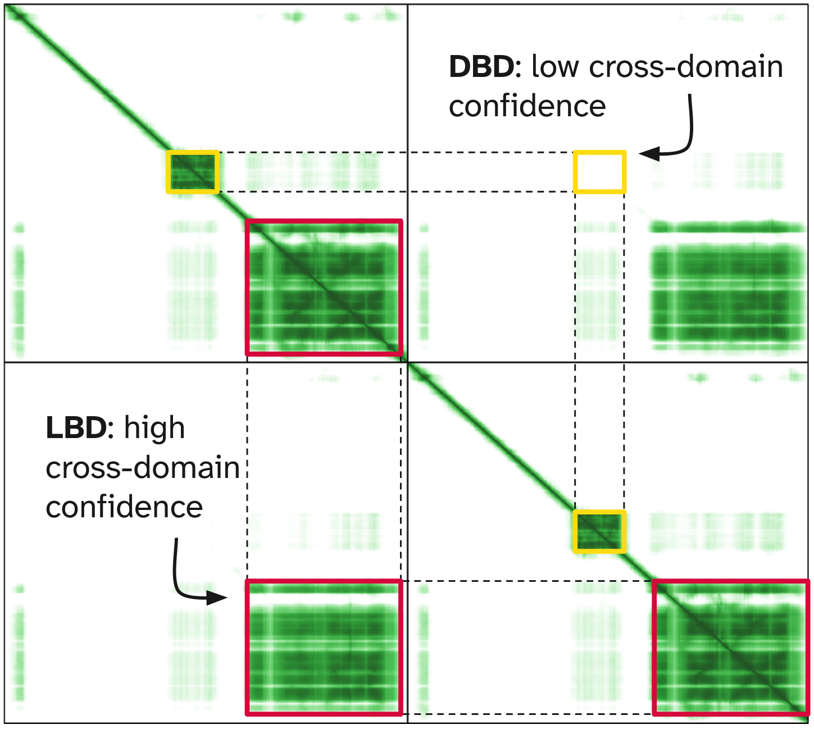
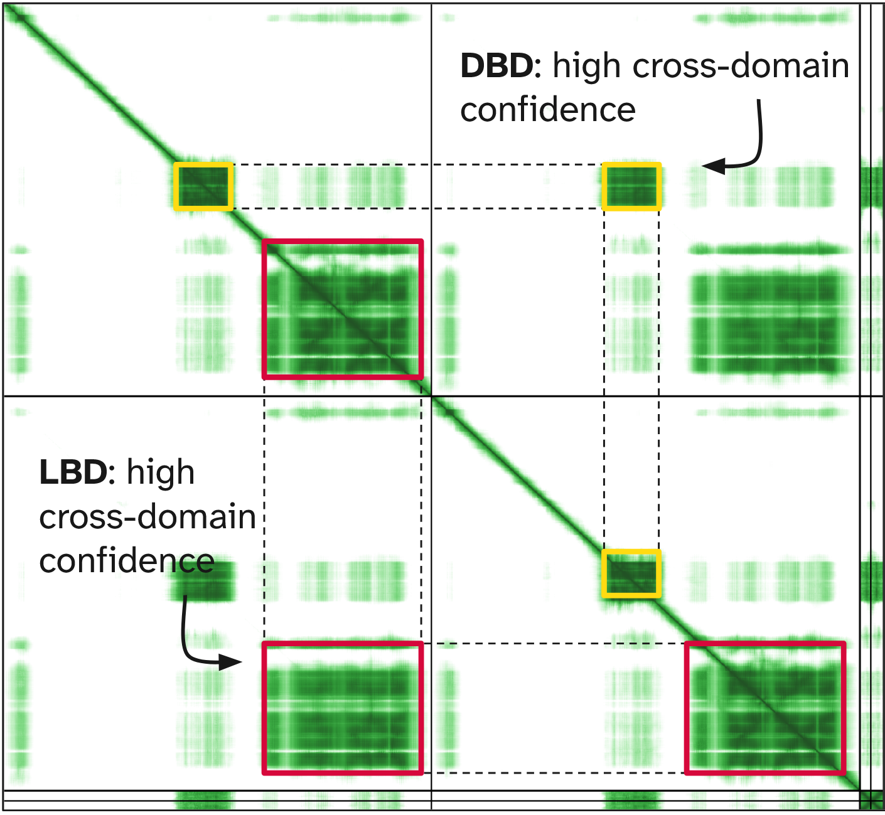
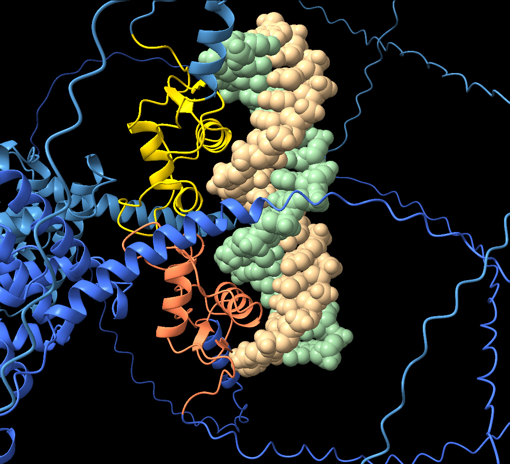
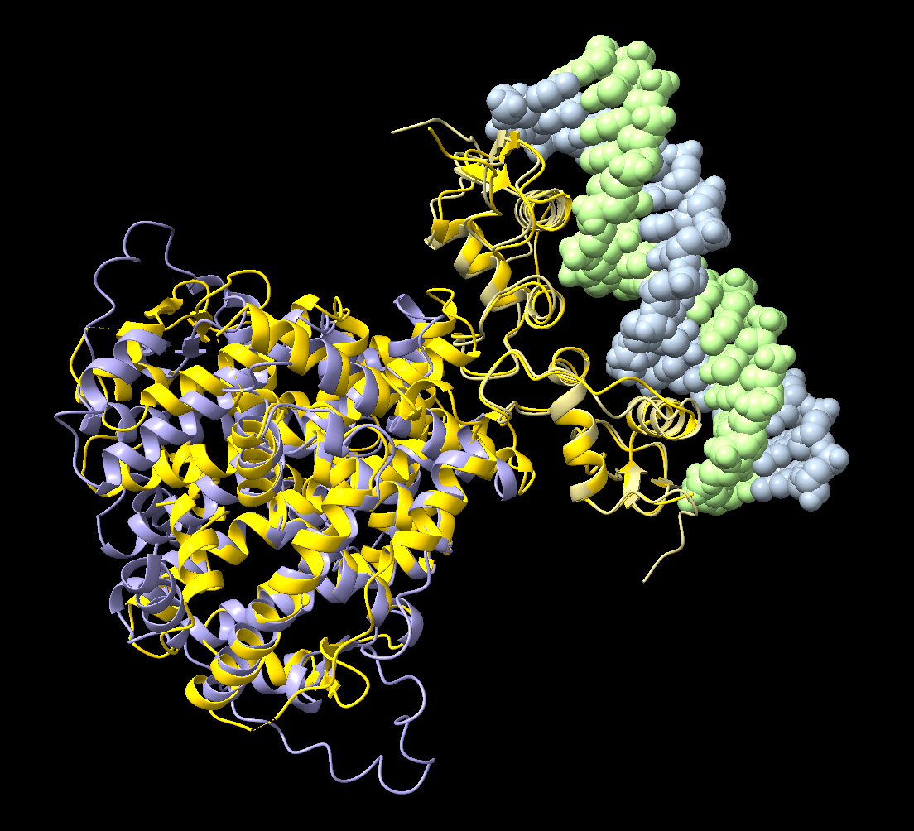

# Predicting protein complexes

:::{.callout-tip}
#### Learning Objectives

- Prepare inputs correctly for multimer predictions using ColabFold (AlphaFold2) and AlphaFold Server (AlphaFold3).
- Understand how AlphaFold models protein complexes.
- Interpret global and interface confidence metrics (pTM and ipTM).
- Use the PAE matrix to assess interactions between chains.
- Evaluate predicted interfaces critically.
- Understand how binding partners (e.g. DNA) can stabilise protein complexes.
:::

## Overview

Many proteins do not act alone.
Instead they form **complexes** with:

- other proteins
- DNA or RNA
- small molecules or ligands

These interactions often determine the biological function of the protein.
For example:

- enzymes may assemble into multimeric complexes
- transcription factors bind DNA
- receptors dimerise when activated

Predicting the structure of a **single monomer** can reveal the fold of a protein.
However, to understand function we often need to predict **how molecules interact**.

AlphaFold can now model such complexes directly.
This process is often called **multimer prediction** or **co-folding**.

## How AlphaFold predicts complexes

When predicting a complex, AlphaFold receives **multiple sequences as input**.
These may represent:

- several copies of the same protein (homomers)
- different proteins (heteromers)
- proteins together with nucleic acids or ligands (AlphaFold3 only)

The model then attempts to predict:

- the fold of each chain
- the **relative positioning of the chains**
- the **interaction interface** between them

This means AlphaFold must solve two related problems:

1. **Folding** - predicting the structure of each individual chain
2. **Docking** - predicting how the chains assemble together

The same confidence metrics used for monomers still apply (e.g. **pLDDT** and **PAE**), but multimer predictions also introduce additional **interface-specific metrics**.

## Multimer confidence scores

When evaluating multimer predictions, it is important to distinguish between:

- **confidence in the fold of each chain**
- **confidence in the interaction between chains**

Several scores help us assess this.

### pLDDT

As for monomers, **pLDDT** reports local confidence in the structure of each residue.
High pLDDT values indicate that the model is confident in the **local geometry of the fold**.

However, high pLDDT **does not guarantee that the interface is correct**.

### PAE

The **Predicted Aligned Error (PAE)** matrix becomes particularly useful in multimer predictions.
The matrix can be divided into blocks:

- **diagonal blocks** describe confidence within each chain
- **off-diagonal blocks** describe confidence between chains

Low PAE values between chains suggest that the **relative positioning of the chains is well defined**.
High cross-PAE indicates that the model is uncertain about the interface.

### pTM and ipTM

Multimer predictions also report global confidence metrics:

- **pTM (predicted TM-score)** - estimates the accuracy of the **overall fold of the complex**

- **ipTM (interface predicted TM-score)** - estimates the accuracy of the **interface between chains**

Typical interpretations are:

| Score      | Interpretation              |
| ---------- | --------------------------- |
| pTM > 0.5  | overall fold likely correct |
| ipTM > 0.7 | interface likely reliable   |
| ipTM < 0.5 | interface uncertain         |

These scores should always be interpreted **together with the PAE matrix and structural inspection**.

## Structure prediction in practice 

::: {.panel-tabset group="language-choice"}
### AlphaFold Server (AlphaFold3)

To perform a multimer prediction using the AlphaFold Server web interface:

1. Submit the sequences of all chains involved in the complex.
2. Specify the **copy number** for each chain if the complex contains multiple identical subunits.
3. If nucleic acids are present, include them as additional sequences.

For example:

- A **homodimer** requires the setting 2 copies for the protein in the input.
- A **heterodimer** requires adding two separate protein entities
- A **protein-DNA complex** requires adding the protein sequence(s) as well as the DNA sequence.
  - When adding DNA, create a DNA entity and then click the `⋮` button to add a **reverse complement copy**

AlphaFold3 automatically performs co-folding of all components.

After the prediction completes, the results include:

- predicted structure files
- global scores (pTM and ipTM)
- per-residue confidence (pLDDT)
- PAE matrices

These outputs can be explored directly on the server or downloaded for visualisation in ChimeraX.

### ColabFold (AlphaFold2)

ColabFold also supports multimer prediction using AlphaFold2.

The **same parameters discussed in the [monomer section](04-monomer.md)** apply here, but an additional parameter becomes important when modelling complexes.

#### Parameter: `pair_mode`

This parameter controls how ColabFold pairs sequences across multiple chains.

AlphaFold relies heavily on **multiple sequence alignments (MSAs)**.
For complexes, these alignments may contain information about **coevolving residues between interacting proteins**.

The `pair_mode` parameter determines how this information is used.

- `unpaired`: Each chain receives its own independent MSA.
  Fast, but ignores possible correlations between interacting chains.

- `paired`: Sequences are paired by species, allowing the model to detect **coevolution between residues of different chains**.
  This can improve interface prediction but often results in sparse alignments.

- `unpaired_paired`: Combines both strategies.

  - full MSAs for learning the fold of each chain
  - paired sequences when available to infer interactions.

This is usually the **recommended option**, as it balances folding accuracy with interface prediction.

:::

## Evaluating predicted interfaces

Evaluating whether the predicted interface is biologically plausible can be done with several checks:

- **Inspect the PAE matrix** - low cross-PAE suggests confident interfaces

- **Examine ipTM scores** - higher scores indicate more reliable interfaces

- **Visualise contacts between chains** - interface residues should form realistic interactions

- **Consider biological context** - does the predicted interface match what is known about the protein?

Importantly, AlphaFold sometimes produces **interfaces that are geometrically plausible but biologically irrelevant**.
Confidence scores and biological knowledge should therefore always be used together.

## Exercises

**Reminder:** 
In this exercise series you are investigating the structure of the amphioxus estrogen receptor and comparing it with experimentally determined human ER structures. 

:::{.callout-exercise}
#### Multimer prediction

The estrogen receptor (ER) forms a homodimer upon ligand binding.
This dimer then migrates to the nucleus, where it binds DNA at conserved ER-response elements (EREs).

So far, our predictions of the amphioxus ER focused on a single copy of the protein.
Your task now is to perform and assess a **homodimer prediction** of the ligand-binding domain (LBD).

Use the annotated LBD sequence from [UniProt entry B3V8B7](https://www.uniprot.org/uniprotkb/B3V8B7):

```
RLKALIDALDVKEGEHRGEENHPTGQQAGNWQEISNPELIESVSSLVDRELTGIICWGKKIPGYSKLSLNDQVLLMESTWLDLLILDLVWCSIRHKGEKLLLSGGVLVNRNTISNRRNNSSGDDMEVLEMCDQILSIATKFYEFDLQRREYLCLKAITLVHGSLKGLESDTQVRQLQDDLTDALMDVCSERHALGSRRPAKMLLLLSHLRQVSARASSHLGAVRNGLKVPLYDILLDILTDQ
```

**Tasks:**

1. Submit the LBD sequence to the [AlphaFold Server (AlphaFold3)](https://alphafoldserver.com), making sure to **set the number of copies to 2** to generate a homodimer prediction. 
   Assess the quality using global (pTM, ipTM) and local (pLDDT, PAE) scores.

2. Compare this prediction with the [preprocessed ColabFold homodimer prediction](https://colab.research.google.com/drive/1XjruIlJemTiVLeOQnipCMZ-GW4YMENch?usp=sharing). 
   Identify regions of lower confidence in each model and compare the global scores.

:::{.callout-answer}

1. AlphaFold3 homodimer prediction:

   - **pTM ≈ 0.80**, indicating high confidence in the overall fold of the complex.  
   - **ipTM ≈ 0.79**, indicating strong confidence in the predicted interaction between the two chains. 
   - **pLDDT** scores are generally high across both chains; lower confidence is seen in flexible loops or hinge regions between helices.
   - **PAE matrix** shows low predicted error along the diagonals of each chain, with higher error in terminal or hinge regions. 
     These flexible regions do not appear to contribute to the interface.

2. Comparison with ColabFold:

   - The top-ranked model from ColabFold () had the following global scores: 
     - average pLDDT = 84.9
     - pTM=0.895
     - ipTM=0.884
     
   - These are very similar (even slightly higher) to the global scores from AlphaFold3, suggesting both versions of AlphaFold are highly confident in this structure. 
   
   - Similarly to the AlphaFold3 prediction, there is lower confidence in loop regions or terminal residues, reflecting intrinsic flexibility.

Even when individual monomer folds are well-predicted, interface confidence can vary.
pTM/ipTM and PAE scores help assess the reliability of predicted oligomers.
:::
:::

:::{.callout-exercise}
#### Assessing dimer interfaces with `alphafold contacts`

We will examine the **interface residues** in more detail using the PAE matrix from our prediction.

Load one of the AlphaFold predictions into a new ChimeraX session (the code below loads the AlphaFold3 prediction):

```chimerax
close
cd ~/Course_Materials/er_amphioxus/lbd_homodimer_af3
open fold_er_amphioxus_lbd_homodimer_af3_model_0.cif
alphafold pae #1 palette paegreen file fold_er_amphioxus_lbd_homodimer_af3_full_data_0.json
```

**Tasks:**

1. Use the ChimeraX command `alphafold contacts` to highlight residues forming the putative interface in the amphioxus prediction.

:::{.callout-answer}

1. To analyse the predicted amphioxus dimer interface:

    ```chimerax
    alphafold contacts #1/A to #1/B distance 5 palette paegreen
    ```

   - This adds _pseudobonds_ between the residues in chain A contacting residues in chain B within a distance threshold of ~5 Å.

:::
:::

:::{.callout-exercise}
#### Co-folding the full receptor with DNA

In previous exercises we predicted individual domains of the estrogen receptor and examined their structures separately. 
However, in the cell the receptor functions as a **multi-component complex**.

After binding ligand, two ER proteins form a **homodimer**. 
This dimer then binds specific DNA sequences called **estrogen response elements (EREs)** through the DNA-binding domains (DBDs).

Importantly, the **relative orientation of the two DBDs is stabilised by the DNA itself**. 
Without DNA, the two domains may not adopt a well-defined position relative to each other.

In this exercise we explore how including DNA in a prediction can change the confidence of the structural model.

We will compare two predictions:

- a **dimer of the full ER protein**
- the **same dimer co-folded with DNA**

This illustrates how co-folding with binding partners can resolve otherwise ambiguous interactions.

**Tasks:**

1. Submit **two copies of the full amphioxus ER sequence** ([link to sequence](https://rest.uniprot.org/uniprotkb/B3V8B7.fasta)) to the AlphaFold Server (AlphaFold3) to predict the receptor dimer.

   - Examine the **PAE matrix**, focusing on the interactions between the two DNA-binding domains.

   - What does the cross-PAE suggest about the relative positioning of the two DBDs?

2. Next, submit the same **two ER sequences together with an estrogen response element (ERE) DNA sequence**.
   Use the following sequence: 
   
    ```
    CCAGGTCACAGTGACCTG
    ```

   - **Hint:** AlphaFold3 expects double-stranded DNA.
     You therefore need to include both this strand and its **reverse complement** as two DNA chains.

   - Again examine the **PAE matrix**, focusing on the interactions between the two DBDs.

3. Compare the two predictions:

   - How does the confidence of the **DBD–DBD interface** change when DNA is included?
   - What does this tell you about the role of DNA in stabilising the receptor complex?

4. Load the co-folded complex in ChimeraX to inspect the predicted structure.

    ```chimerax
    close
    cd ~/Course_Materials/er_amphioxus/full_homodimer_dna_complex_af3/
    open fold_er_amphioxus_full_homodimer_dna_complex_af3_model_0.cif
    color bychain
    cartoon hide nucleic
    nucleotides atoms
    style nucleic sphere
    ```

   - What do you observe about the positioning of the two DNA-binding domains relative to the DNA?
   - It may help to import UniProt annotations (ID: B3V8B7) and colour the DBDs to identify them more easily.

:::{.callout-answer}

1. When predicting the **ER homodimer without DNA**, the model shows:

   - good confidence for the **ligand-binding domain dimer**
   - high **cross-PAE between the two DNA-binding domains**

   This indicates that the model is **uncertain about the relative positioning of the two DBDs**.

{width=50% fig-align="center"}

2. When the **DNA sequence is included**, the prediction changes:

   - the two DBDs bind opposite halves of the DNA response element
   - the **cross-PAE between the DBDs becomes low**
   - the model is now confident about their relative orientation.

{width=50% fig-align="center"}

3. This shows that the **DBDs do not form a stable interface on their own**.  
   Instead, their positioning is stabilised when both domains bind the DNA sequence.

3. We import UniProt annotations (ID: B3V8B7):

    ```chimerax
    open B3V8B7 from uniprot format uniprot
    ```
   
   - From the annotation panel, we select "domain" → "Nuclear receptor", which highlights residues 294-370. 
     Based on this, we assign distinct colours to the different parts of each chain for easier visualisation: 

    ```chimerax
    color /A steelblue
    color /B royalblue
    color /A:294-370 gold
    color /B:294-370 coral
    ```

{width=50% fig-align="center"}

From this analysis, we can see that:

   - the two DBDs insert recognition helices into the **major groove of the DNA**
   - each domain binds one half of the response element
   - the two domains make a small interface while bound to DNA.

This behaviour reflects the biological mechanism of nuclear receptors:  
the **ligand-binding domains drive dimerisation**, while the **DNA-binding domains are positioned by the DNA response element itself**.

The high PAE between the DBDs in the absence of DNA is not a modelling failure - it reflects a real biological property. 
The domains only adopt a stable relative orientation when DNA is present, and including the DNA sequence in the prediction provides the constraint needed to resolve the complex.
:::
:::

:::{.callout-exercise}
#### Full receptor complex comparison with human structures

Open the AlphaFold3 prediction of the full complex:

```chimerax
close
cd ~/Course_Materials/er_amphioxus/full_homodimer_dna_complex_af3/
open fold_er_amphioxus_full_homodimer_dna_complex_af3_model_0.cif
color bychain
cartoon hide nucleic
nucleotides atoms
style nucleic sphere
```

You will now compare the structure prediction of the LBD and DBD domains with the known human structures, to assess how good the prediction of the full complex was. 
To make this comparison easier, we split our full complex model into sub-models for each domain: 

```chimerax
split #1 atoms #1/A-B:441-682 atoms #1/A-B:294-370 atoms #1/C-D
colour byidentity
cartoon hide #1.4
```

Looking at the output of `info models` you will see that we now have three sub-models:

- `#1.1` is the ligand-binding domain, annotated as residues 441-682 on UniProt
- `#1.2` is the DNA-binding domain, annotated as residues 294-370 on UniProt
- `#1.3` is the DNA chains
- `#1.4` is rest of the structure (disorganised regions)

**Tasks:**

1. Use the commands below to import the human ligand-binding dimer (PDB: 1ERE, chains A and B), and then align it with model `#1.1` (the LBD domain).

    ```chimerax
    open 1ERE
    delete #2/C-F
    hide #2 atoms
    cartoon #2
    colour #2 gold
    ```

2. Use the commands below to import the human DNA-binding dimer (PDB: 1HCQ), and then align it with model `#1.2` (the DBD domain).

    ```chimerax
    open 1HCQ
    delete #3/C-H
    hide #3 atoms
    cartoon #3
    colour #3 gold
    ```

What is your conclusion about the ability of AlphaFold3 to predict the full complex structure?

:::{.callout-answer}

We align each of the human structures to our models: 

```chimerax
mm #2 to #1.1
mm #3 to #1.2
```

{width=50% fig-align="center"}

Overall we can see a strong agreement between the predicted amphioxus domains and the experimentally determined human structures, indicating that AlphaFold3 successfully captured the geometry of both the ligand-binding and DNA-binding domains within the full receptor complex.

Several observations can be made from this comparison:

- The **ligand-binding domain (LBD)** of the amphioxus receptor aligns very closely with the human LBD dimer. 
  This shows that the core helical architecture of the domain and its dimerisation interface are strongly conserved across evolution, despite substantial sequence divergence between these species (only ~30% sequence identity in this domain).

- The **DNA-binding domains (DBDs)** also align well with the human ER structure bound to DNA. 
  In particular, the recognition helices of each DBD are positioned in the DNA major groove in a manner very similar to the experimental structure.

- Earlier in the exercises we saw that predicting the ER dimer **without DNA resulted in high cross-PAE between the DBDs**, indicating uncertainty about their relative positioning. 
  When DNA was included in the prediction, the DBDs adopted a well-defined orientation with low cross-PAE. 
  This reflects the biological mechanism of nuclear receptors, where DNA binding helps stabilise the arrangement of the two DBDs.

Taken together, these results show that AlphaFold3 is able to reconstruct the overall architecture of a multi-component complex by combining several sources of information: the intrinsic fold of each domain, the dimerisation interface of the LBD, and the structural constraints imposed by DNA binding.

This final comparison also illustrates a broader principle in structural bioinformatics: **structural features that are critical for function are often conserved across large evolutionary distances**, even when the underlying amino acid sequences differ substantially.
:::
:::

## Summary

::: {.callout-tip}
#### Key Points

- Many proteins function as oligomers rather than as single monomers.

- Structure prediction methods can model protein-protein or protein-nucleic acid complexes.

- Considering the biological assembly is often essential for understanding protein function.
:::
