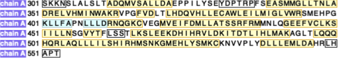
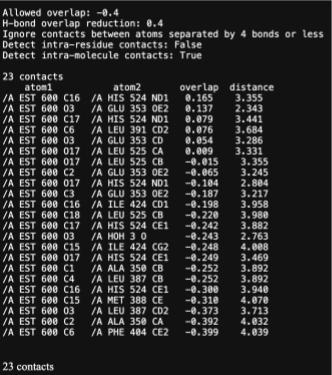
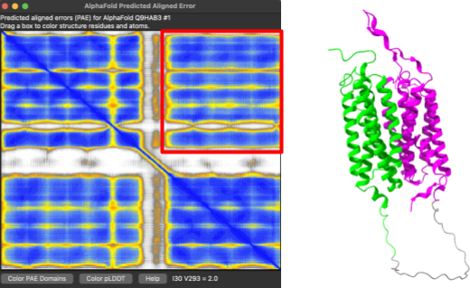
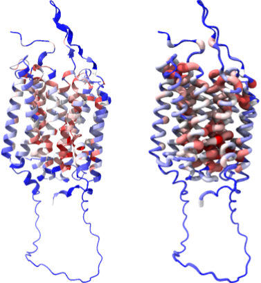

::: {.callout-tip}
#### Learning Objectives

- Bulleted list of learning objectives
:::

## Section

Headings for material sections start at level 2. 

More guidelines for content available here: https://cambiotraining.github.io/quarto-course-template/materials/02-content_guidelines.html

## Exercises

::: {.callout-tip collapse="true"}
## Case study 1 - basic features of ChimeraX

We will be using the structure of the ligand binding domain of the Estrogen Receptor (PDB: 1ERE).

The Estrogen Receptor is:

- A member of the Nuclear Receptor family of transcription factors

- Implicated in some breast and ovarian cancers

- Activates gene expression upon binding of its ligand, estradiol

- Targeted by several FDA-approved drugs

### Exercise - Selections using the CLI
Spend 1-2 minutes now trying to select different parts of the protein:

- Select chain B and chain D in the model

- Select the CA atom (alpha carbon) on residue 510 of chain C

- Select everything except chain E

### Exercise - Sequence viewer

Consider the sequence below:

Why are some residues in a black border?

:::

::: {.callout-tip collapse="true"}
## Case study 2 - basics of protein structure analysis

We will continue using the structure of the ligand binding domain of the Estrogen Receptor (PDB: 1ERE).

There are numerous drugs that are designed to target the Estrogen Receptor as treatment for breast cancer and other reproductive diseases, and all of them interact with the receptor in its ligand binding pocket. 

We will learn to analyse the protein-ligand interactions of the Estrogen Receptor. The same tools can be used to analyse predicted interactions between AlphaFold models and ligands.

### Exercise - Reveal other interactions

Consider the following diagram:

What does this information tell us about potential mutations at these positions?

:::

::: {.callout-tip collapse="true"}
## Case study 3 - analysis of predicted structures

We will use a protein called SLC52A2 (UniProt ID: Q9HAB3), a human protein that currently has no experimentally-solved structure.
This is a membrane transporter for vitamin B2/riboflavin. 

Some mutations in SLC52A2 can cause a childhood onset motor neuron disease known as Brown-Vialetto-Van Laere syndrome. 

These mutations are thought to reduce protein expression or reduce riboflavin uptake

### Exercise - AlphaFold confidence scores

Drag your mouse across the PAE plot below to highlight the corresponding residues on the protein

What does this PAE plot tell us about the relative positions of the main parts of this protein?

### Exercise - Fetching information from AlphaMissense

With the following command: `cartoon byattribute r:avg #!1` and the images below:

Which areas of the structure are least tolerant to mutations and why?

:::

## Summary

::: {.callout-tip}
#### Key Points

- Last section of the page is a bulleted summary of the key points
:::
