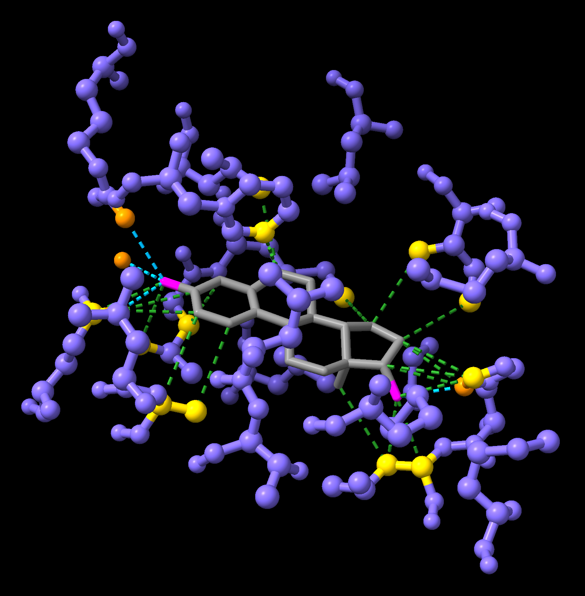

# Analysing protein-ligand interactions

:::{.callout-tip}
#### Learning Objectives

- Visualise protein-ligand complexes in ChimeraX.
- Identify hydrogen bonds and other intermolecular contacts.
- Explore ligand binding pockets using surface representations.
- Select residues interacting with a ligand using distance-based selections.
- Interpret the structural features that stabilise ligand binding.
:::

## Overview

Proteins often interact with **small molecules**.
These molecules may be:

- natural metabolites
- signalling molecules
- cofactors
- drugs designed to target a protein

The region where a small molecule binds is called the **binding pocket**.
Understanding this pocket is central to many areas of biology and medicine, including **drug design**.

In this section we will learn how to analyse **protein-ligand interactions** using ChimeraX.

As an example, we will continue working with the **estrogen receptor** structure (PDB: **1ERE**).
This structure contains the hormone **estradiol**, labelled `EST` in the PDB file.

The estrogen receptor is an important drug target.
Many therapies for breast cancer act by blocking or modifying ligand binding in this pocket.

The same tools we use here also apply to:

- experimentally determined structures
- predicted protein models
- predicted ligand docking results

## Preparing the structure

We begin by loading the structure and keeping a single chain for clarity.

```chimerax
close
open 1ERE
delete #1/B-F
```

Next we create a visual representation that highlights the ligand.

```chimerax
style protein ball
hide atoms
show cartoon
show :EST atoms
style :EST sphere
colour :EST & C grey
colour :EST & O magenta
cofr :EST
```

These commands:

- show the protein as a **cartoon**, emphasising secondary structure
- display the ligand as **atoms**
- colour the ligand atoms by element
- set the **centre of rotation (`cofr`)** on the ligand for easier inspection

The result is a view of the receptor with the ligand clearly positioned in the binding pocket.

## Hydrogen bonds

One of the most important stabilising interactions between proteins and ligands is the **hydrogen bond**.
Hydrogen bonds often determine:

- ligand specificity
- binding affinity
- orientation of the ligand in the pocket

ChimeraX can detect hydrogen bonds automatically using the `hbonds` command.

```chimerax
hbonds :EST reveal true log true
```

- `reveal true` displays hydrogen bonds as **cyan dashed lines** and reveals the corresponding atoms involved in the interaction
- `log true` reports the interaction details in the **log window**

The output lists the atoms involved and the distances between them.
Keep in mind that hydrogen bonds are **inferred geometrically** based on distance and angle criteria.

## Other contacts

Hydrogen bonds are not the only interactions stabilising ligand binding.
Ligands are often held in place by **non-specific contacts**, such as van der Waals interactions.

These interactions can be detected using the `contacts` command.

```chimerax
contacts :EST reveal true log true
```

This command displays nearby atoms as **green dashed lines**, and reveals the corresponding atoms involved in the interaction.

Together, hydrogen bonds and other contacts provide a useful picture of how the ligand fits inside the binding pocket.

## Surface representation

To better visualise the binding pocket, we can display the **molecular surface** of the ligand.

```chimerax
style :EST stick
show :EST surfaces
surface :EST color white transparency 65
```

Surface representations help illustrate:

- how tightly the ligand fits inside the pocket
- which parts of the ligand remain exposed to solvent
- the shape of the binding cavity

Surfaces are especially useful when examining **drug binding sites**.

## Selecting residues near the ligand

Often we want to focus only on the residues that form the binding pocket.
ChimeraX allows **distance-based selections** using the `<` operator.

The following command shows residues **within 5 Å** of the ligand:

```chimerax
hide protein cartoon
hide protein atoms
show :EST :<5
```

This reveals only the local environment surrounding the ligand.

Distance-based selections are useful for:

- identifying binding pocket residues
- analysing mutation effects
- preparing structures for docking or modelling studies

## Exercises

:::{.callout-exercise}
#### Select atoms involved in interactions

In this exercise we will attempt to colour the protein atoms involved in the interactions between the ligand and the protein.



Start your session using the following code, which will show the ligand and the residues within 5 Å of the ligand, as well as the hydrogen bonds and contacts between the ligand and the protein.

```chimerax
close
open 1ERE
delete #1/B-F
style protein ball
style :EST stick
hide protein
hide solvent
colour :EST & C grey
colour :EST & O magenta
show :EST :<5
cofr :EST
hbonds :EST reveal true log true
contacts :EST reveal true log true
```

Using a combination of `select` and new keywords listed below, try to: 

- Colour the protein atoms involved in hydrogen bonds in `darkorange`
- Colour the protein atoms involved in contacts in `gold`

Here are some useful keywords to select atoms involved in interactions: 

- `hbonds` selects the pseudobonds (dashed lines) representing the hydrogen bonds
- `pbonds` selects all pseudobonds (including both hydrogen bonds and contacts)
- `hbondatoms` selects the atoms as well as pseudobonds involved in the hydrogen bonds 
- `pbondatoms` selects the atoms as well as pseudobonds involved in the contacts

:::{.callout-hint}
Work on your selection incrementally, making use of the `select subtract` command to deselect certain items from your initial selection.
:::

:::{.callout-answer}

We can achieve this in several incremental steps:

```chimerax
select pbondatoms
select subtract pbonds
select subtract :EST
colour sel gold
```

- `select pbondatoms` selects all atoms and pseudobonds involved in both hydrogen bonds and contacts 
- `select subtract pbonds` deselects the pseudobonds, leaving only the atoms selected 
- `select subtract :EST` deselects the ligand atoms, leaving only the protein atoms selected 
- `colour sel gold` colours the selected atoms gold 

Then we can repeat the same steps for hydrogen bonds: 

```chimerax
select hbondatoms
select subtract hbonds
select subtract :EST
colour sel darkorange
select clear
```

:::
:::

:::{.callout-exercise}
#### Edit the bond representation

You may notice that some contacts overlap with the hydrogen bonds. 
Reading the [documentation for the `size` command](https://www.cgl.ucsf.edu/chimerax/docs/user/commands/size.html), can you find a way to make the hydrogen pseudobonds thicker, so they stand out?

:::{.callout-answer}

We can use the `pseudobondRadius` attribute to change the thickness of the pseudobonds, making sure to apply this only to the hydrogen bonds, using the `hbonds` selector keyword:

```chimerax
size hbonds pseudobondRadius 0.1
```

:::
:::
