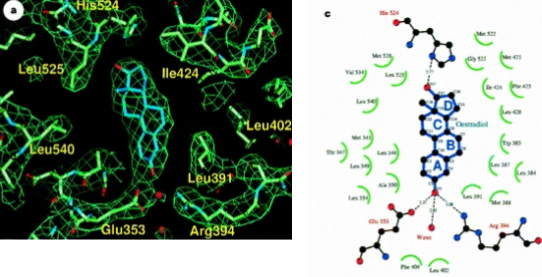
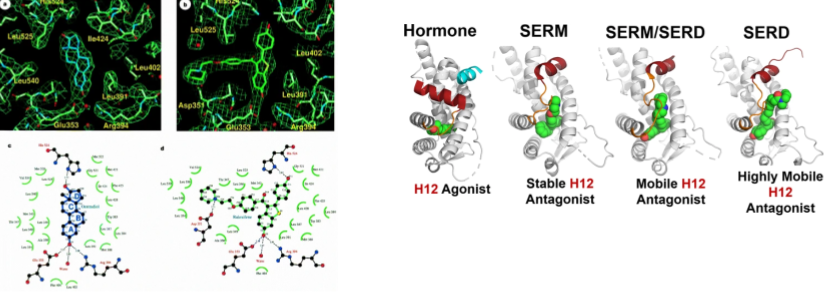

::: {.callout-tip}
#### Learning Objectives

- Bulleted list of learning objectives
:::

## Section

Headings for material sections start at level 2. 

More guidelines for content available here: https://cambiotraining.github.io/quarto-course-template/materials/02-content_guidelines.html

## Exercise

- 1ERE (Human Estrogen Receptor bound with Estradiol)

- How does the ligand interact with the protein?

- Try different methods to identify the interactions.

## Exercise

1ERE (Human Estrogen Receptor bound with Estradiol)
Modelled protein from previous exercises
Where are potential pockets located on the protein surface?

`$ fpocket -f protein.cif`

## Summary

::: {.callout-tip}
#### Key Points

- Last section of the page is a bulleted summary of the key points
:::
