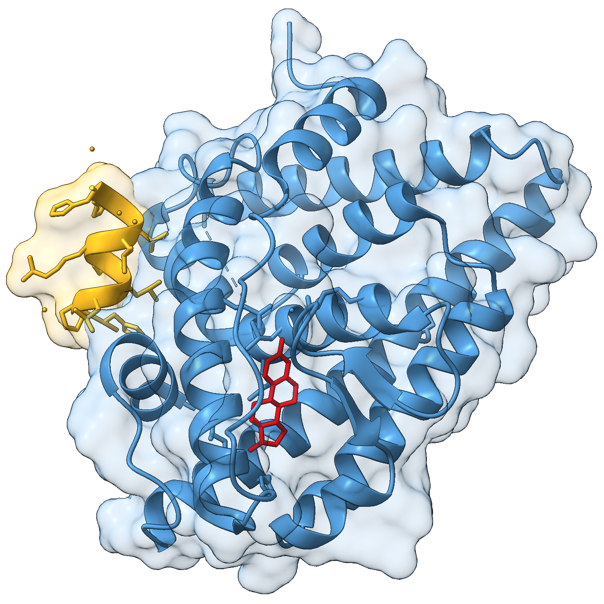
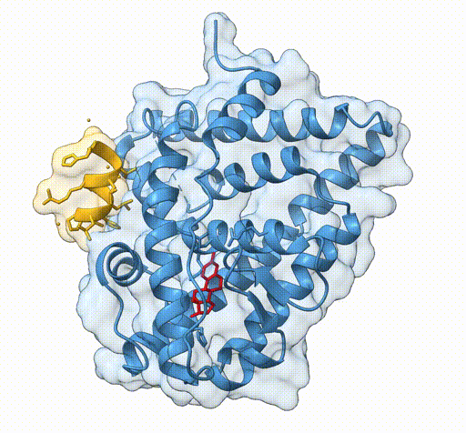
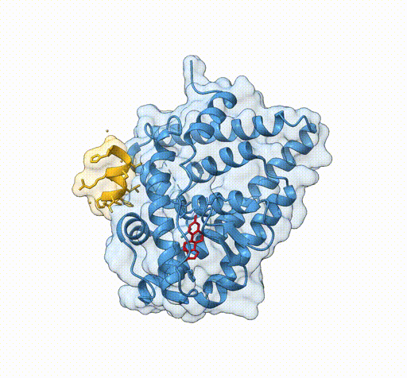
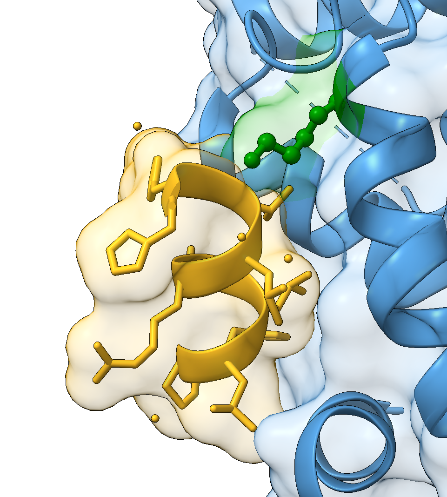
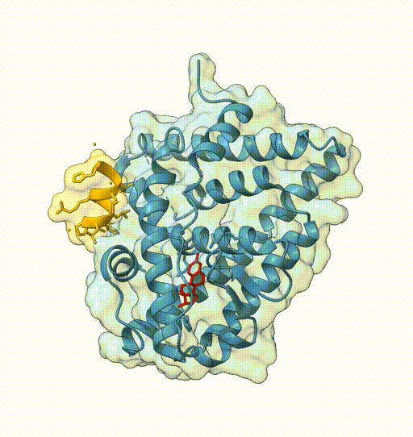
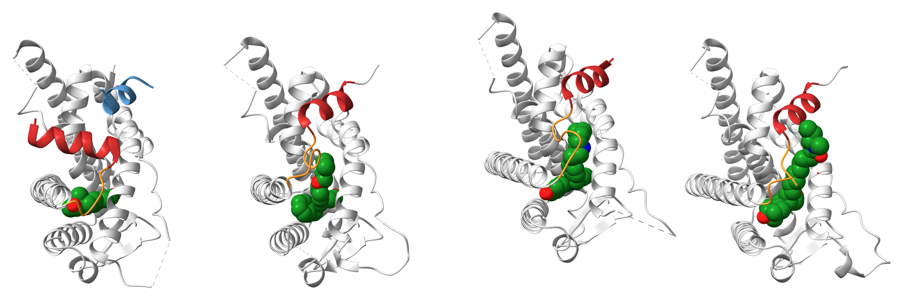
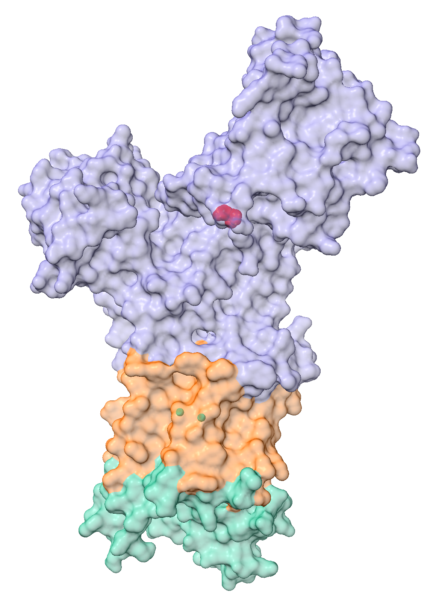

# Publication-quality visualisations

:::{.callout-tip}
#### Learning Objectives

- Create clear and informative molecular visualisations using ChimeraX.
- Combine structural representations such as cartoons, surfaces, and atoms.
- Adjust lighting, background, and outlines to improve figure clarity.
- Generate rotating or animated movies of molecular structures.
- Use tiled views to compare multiple structures simultaneously.
:::

High-quality molecular visualisations are an important part of communicating structural biology results.
Figures used in publications or presentations should aim to be:

- **informative** - highlighting the structural features relevant to the question
- **clear** - avoiding unnecessary clutter
- **visually consistent** - using colour and representation carefully

ChimeraX provides a wide range of tools for producing such figures.

The [ChimeraX gallery](https://www.cgl.ucsf.edu/chimerax/gallery.html) showcases many examples of publication-quality visualisations.
Each example includes a downloadable `.cxc` script that reproduces the image using ChimeraX commands.

Studying these scripts is often a useful way to learn new visualisation techniques.

## Surface representation

Consider the following view of the estrogen receptor in complex with a conserved peptide motif characteristic of activator proteins (PDB: **4J26**).



This visualisation combines several features to highlight the interaction between the receptor and the peptide.

Below are the commands used to generate the figure:

```bash
close
open 4J26
delete /A,I
set bgcolor white
label delete
light simple
graphics silhouettes true width 1
show /J atoms
color /B steelblue
color /J goldenrod
color :EST red
surface /B transparency 85
surface /J transparency 85
```

We begin by loading the structure and simplifying the model.

The crystal structure contains **two receptor-peptide complexes**, so we remove chains A and I to keep only one complex.

```bash
delete /A,I
```

Next we adjust the global visual settings.

```bash
set bgcolor white
label delete
light simple
graphics silhouettes true width 1
```

These commands:

- set a **white background**, which is standard for publications
- remove default residue labels
- use **simple lighting** to improve contrast
- add **silhouettes** (black outlines) around objects

Silhouettes are particularly useful because they help the structure stand out clearly against the background.

We then highlight the relevant structural components.

```bash
show /J atoms
color /B steelblue
color /J goldenrod
color :EST red
```

Here we:

- display the **coactivator peptide** atoms
- colour the receptor chain blue
- colour the peptide gold
- colour the ligand red

Using distinct colours makes it easier to identify the different molecular components.

Finally, we display **transparent molecular surfaces** for both chains:

```bash
surface /B transparency 85
surface /J transparency 85
```

The transparent surface illustrates the **shape of the binding interface**, while still allowing the underlying secondary structure to remain visible.

## Creating a movie

Movies can help illustrate structural features that are difficult to appreciate in a static image.

ChimeraX supports several types of automatic motion:

- `rock` - oscillating back-and-forth motion
- `roll` - continuous 360 degree rotation
- `wobble` - figure-eight style motion
- `turn` - flexible rotation around arbitrary axes

The general workflow for creating a movie is:

1. start recording
2. perform the desired movement
3. stop recording
4. encode the frames into a video file

### Example: rocking animation

We can create a rocking animation of the estrogen receptor using:

```bash
rock
```

To stop the motion:

```bash
stop
```

To record a movie, we use the `movie record` command.
It is helpful to record **complete motion cycles**, so that the movie loops smoothly.

According to the ChimeraX documentation, the default rocking motion completes one cycle in **136 frames**.
We therefore record one full cycle using:

```bash
movie record
rock
wait 136
stop
```

Finally, we encode the movie as an MP4 file:

```bash
movie encode 4j26_rock.mp4 framerate 60
```

The `framerate` option determines how many frames are shown per second in the final movie.



## Animated views

ChimeraX also allows you to define **named views** and smoothly transition between them.
This approach is useful for guiding the viewer through different parts of a structure.

First we define a set of views:

- View 1: entire protein
- View 2: coactivator peptide
- View 3: ligand binding site

```bash
view protein
view name 1
view /J
view name 2
view ligand
view name 3
```

Each `view name` command stores the current camera position.
We can then transition between these views while recording a movie.
The syntax:

```
view <name> <frames>
```

controls how long the transition takes.

For example:

```bash
view 1
movie record
view 2 60
wait 80
view 1 30
wait 30
view 3 60
wait 80
view 1 30
wait 30
movie encode 4j26_views.mp4 framerate 30
```

Deciding on the framerates for each view and transition can require some trial and error, but it helps to think about it in relation to the **framerate used to encode the movie**.
In this example:

- the movie is encoded at **30 frames per second**
- a transition of **60 frames** corresponds to **2 seconds**
- pauses are introduced using the `wait` command



## UniProt annotations

Functional annotations can also be incorporated into visualisations.

For example, we can retrieve UniProt information for the estrogen receptor.
The UniProt identifier for the receptor is **P03372**:

```bash
open P03372 from uniprot format uniprot
```

This opens the **sequence annotation panel**, where features such as domains, mutations, and binding sites can be inspected.
Selecting a feature highlights the corresponding residues in the structure.

For example, one of the mutations annotated in UniProt is described as: "K → R completely inactive in positive regulation of DNA-binding transcription factor activity".
Once selected, the residue can be highlighted in the structure:

```bash
select /B:314
show sel atoms
style sel ball
colour sel green
select clear
```

Highlighting biologically important residues is often helpful when preparing figures that illustrate **functional mechanisms**.



## Tiled views

ChimeraX also supports **tiled layouts**, allowing multiple structures to be displayed side-by-side.
This is particularly useful when comparing:

- different ligand-bound structures
- conformational states
- homologous proteins

The `tile` command automatically arranges open models into a grid layout.
For example:

```bash
tile column 4 spacingfactor 0.8
```

This arranges four models in a **single row**, with slightly reduced spacing between panels.
Tiled views are frequently used in publications to compare related structures under consistent orientations.

## Exercises

:::{.callout-exercise}
#### Roll animation

Create a movie of the oestrogen receptor structure rotating 360 degrees around the y-axis.
Save it as a mp4 file.



:::{.callout-hint}
- You can use the `roll` command to rotate the structure around the y-axis.
- Use the `wait` command to specify how long you want the movie to be in framerates (number of frames per second). From the help for the `roll` command, we can see that by default the frames rotate at 1 degree per frame, so a full 360 degree rotation would take 360 frames.
- Use the `movie record` and `movie encode` commands to save the movie as an mp4 file.
:::

:::{.callout-answer}

Here are the commands to create the movie:

```bash
roll
movie record
wait 360
stop
movie encode 4j26_roll.mp4 framerate 60
```

In this case, we have decided to use a framerate of 60 frames per second, so the movie will be 6 seconds long (360 frames / 60 frames per second = 6 seconds).
If you wanted a slower-rotating movie, you could use a lower framerate (e.g. 30 frames per second), which would make the movie 12 seconds long (360 frames / 30 frames per second = 12 seconds).

:::
:::

:::{.callout-exercise}
#### Combining animated views and rocking

Going back to our video transitioning between different views:

```bash
view 1
movie record
view 2 60
wait 80
view 1 30
wait 30
view 3 60
wait 80
view 1 30
wait 30
movie encode 4j26_views.mp4 framerate 30
```

Can you modify the code above, to include a rocking movement after zooming in on view 2 and view 3?


:::{.callout-answer}

To achieve this, we add a `rock` command after view 2 and view 3, ensuring to include a `wait` command before stopping the motion. 
The default `rock` framerate is 136, so we set `wait` to that same number of frames. 
We therefore include the following code after view 2 and view 3:

```bash
rock
wait 136
stop
```

Here is the commented code in full:

```bash
# Start the movie with view 1
view 1
movie record

# View 2 with rocking motion
view 2 60
wait 60

# Add rocking motion to view 2
rock
wait 136
stop

# Transition back to view 1
view 1 30
wait 30

# View 3 with rocking motion
view 3 60
wait 60

# Add rocking motion to view 3
rock
wait 136
stop

# Transition back to view 1
view 1 30
wait 30

# Encode the movie as an mp4 file
movie encode 4j26_views_rock.mp4 framerate 30
```

:::
:::


:::{.callout-exercise}
#### Tiled views

Try to recreate this view of the Oestrogen Receptor complexed with different ligands (PDBs: 1GWR, 5W9C, 4XI3, and 7R62):

. Figure caption from the original publication: "Ligands are shown as spheres with carbon in green, oxygen in red, and nitrogen in blue, helix 12 is colored red, the helix 11–12 loop is colored orange, and coregulator peptide in cyan."](https://media.springernature.com/full/springer-static/image/art%3A10.1038%2Fs41523-022-00497-9/MediaObjects/41523_2022_497_Fig1_HTML.png?as=webp)

- Import all the structures into a new ChimeraX session. 
- These models each have multiple chains, but we will work with only **chain A** in each structure, plus their respective **ligands**, listed below. 
  **Create a selection** to only show these chains and ligands, and **delete the rest of the structure**.
  - `1GWR`: bound to the hormone estradiol (residues named `:EST`); also include the coregulator peptide motif (chain `/C`)
  - `5W9C`: bound to the tamoxifen-derived drug 4-hydroxytamoxifen (residues named `:OHT`)
  - `4XI3`: bound to the drug bazedoxifene (residues named `:29S`)
  - `7R62`: bound to a synthetic estradiol-like inhibitor (residues named `:3YJ`)
- Align the structures to each other to ensure similar orientations, and tile the views in a 1x4 grid.
- Colour the protein in silver, and the ligands by element (carbon in green, oxygen in red, and nitrogen in blue).
- Show the coregulator peptide motif in cyan.
- Use the sequence viewer to identify the positions of helix 12 in each structure, and colour it red, and the helix 11-12 loop in orange.

:::{.callout-answer}

We start by opening the structures of interest:

```bash
close
open 1GWR
open 5W9C
open 4XI3
open 7R62
```

We then select chain A and the ligand for each structure, and delete the rest of the structure:

```bash
select #1/A | #1/C | #1/A:EST | #2/A | #2/A:OHT | #3/A | #3/A:29S | #4/A | #4/A:3YJ
delete ~sel
select clear
```

We have opted to use the OR `|` operator to select multiple chains and ligands at the same time, but you could also do this in multiple steps if you prefer using the `select add` command. 

We then align the structures to each other to ensure similar orientations:

```bash
mm #2-4 to #1
```

We tile the views using the `tile` command, and colour the structures using `silver`, similar to the original publication:

```bash
tile column 4 spacingfactor 0.8
colour protein silver
hide protein atoms
```

We represent the ligands as spheres, and colour them by element:

```bash
show ligand atoms
style ligand sphere
colour ligand & C green
colour ligand & O red
colour ligand & N blue
```

We show the coregulator peptide in cyan:

```bash
hide #1/C atoms
cartoon #1/C
colour #1/C cyan
```

To identify the helix positions, we can use the sequence viewer, which highlights the secondary structure of each residue (helices shown as yellow boxes).
Helix 12 is the last helix of each structure, and these are its positions: 

```bash
colour #1/A:537-549 firebrick
colour #1/A:532-536 darkorange
colour #2/A:536-545 firebrick
colour #2/A:529-535 darkorange
colour #3/A:536-545 firebrick
colour #3/A:529-535 darkorange
colour #4/A:536-545 firebrick
colour #4/A:528-535 darkorange
```

Optionally, we can hide the missing residue labels, which are stored as sub-models (see `info models`):

```bash
hide #1.1.1 #2.1.1 #3.1.1 #4.1.1
```

And this gets us close to the original publication: 



:::
:::

:::{.callout-exercise}
#### Surface representation

Try and recreate this RCSB-PDB molecule of month view (PDB: 1AOI):

](https://cdn.rcsb.org/pdb101/motm/7/1aoi.gif)

Make sure to colour each DNA chain slightly differently. 
You can use `log chains` to find out which chains correspond to the protein and which are the DNA.

:::{.callout-answer}

This gets us close to the visualisation:

```bash
close
open 1AOI
surface protein
surface nucleic
colour protein plum
colour /I tomato
colour /J coral
```

We used `log chains` to find out that chains I and J correspond to the DNA, and coloured them differently using the `colour` command.

:::
:::


:::{.callout-exercise}
#### UniProt annotations

Try to create a similar view to the following RBSB-PDB molecule of the month (PDB: 1SU4).

](https://cdn.rcsb.org/pdb101/motm/51/1eul-membrane.gif)

It might be hard to recreate exactly the same view, but here are some guidelines for what you could try: 

- Hide the atoms
- Draw a surface representation of the protein using a transparency of 60%
- Show the calcium ion and colour it cyan
  - Use `log metadata` to see how the Calcium molecule is called
- Import metadata from UniProt (you might have to go to PDB to find the UniProt ID). This should allow you to select: 
  - Active site: Show as atoms and colour red 
  - Topological domain lumenal: Colour `#1b9e77`
  - topological domain cytoplasmic: Colour `#7570b3`
  - transmembrane region: Colour `#d95f02`

:::{.callout-answer}

We start by opening the structure and hiding the atoms, then showing the surface representation of the protein with a transparency of 60%, and showing the CA atoms coloured cyan:

```bash
close
open 1SU4
hide cartoon
hide atoms
surface protein transparency 60
show :CA
colour :CA cyan
```

We import metadata from UniProt, using the UniProt ID P04191, which we can find in the PDB entry for 1SU4:

```bash
open P04191 from uniprot format uniprot
```

We select each of the features indicated, and colour them accordingly. 
Here, we give the exact residues, which we copied from the log window, as we clicked on each of the UniProt annotations.

```bash
select /A:70-89,274-295,778-787,852-897,950-964
colour sel #1b9e77
select /A:1-48,111-253,314-757,809-828,918-930,986-994
colour sel #7570b3
select /A:49-69,90-110,254-273,296-313,758-777,788-808,829-851,898-917,931-949,965-985
colour sel #d95f02
select /A:351
show sel atoms
style sel sphere
colour sel red
select clear
```

This should give you the following view:



:::
:::


<!--
NOTE: leaving this here as a note

Converting a MP4 to GIF with ffmpeg:

```bash
# this gives higher quality but larger file size
ffmpeg \
  -i 4j26_rock.mp4 \
  -r 20 \
  -vf "crop=iw*0.6:ih*0.95,scale=512:-1,split[s0][s1];[s0]palettegen[p];[s1][p]paletteuse" \
  -ss 00:00:00 \
  4j26_rock.gif

ffmpeg \
  -i 4j26_rock.mp4 \
  -r 20 \
  -vf "scale=512:-1,split[s0][s1];[s0]palettegen[p];[s1][p]paletteuse" \
  -ss 00:00:00 \
  4j26_rock.gif


ffmpeg \
  -i 4j26_roll.mp4 \
  -r 15 \
  -vf "crop=iw*0.5:ih*0.90,scale=512:-1" \
  -ss 00:00:00 \
  4j26_roll.gif
  
ffmpeg \
  -i 4j26_rock.mp4 \
  -r 15 \
  -vf "crop=iw*0.6:ih*0.95,scale=512:-1" \
  -ss 00:00:00 \
  4j26_rock.gif

ffmpeg \
  -i 4j26_views.mp4 \
  -r 15 \
  -vf "crop=iw*0.6:ih*0.95,scale=512:-1" \
  -ss 00:00:00 \
  4j26_views.gif
  
ffmpeg \
  -i 4j26_views_rock.mp4 \
  -r 15 \
  -vf "crop=iw*0.6:ih*0.95,scale=512:-1" \
  -ss 00:00:00 \
  4j26_views_rock.gif
``` 
-->
