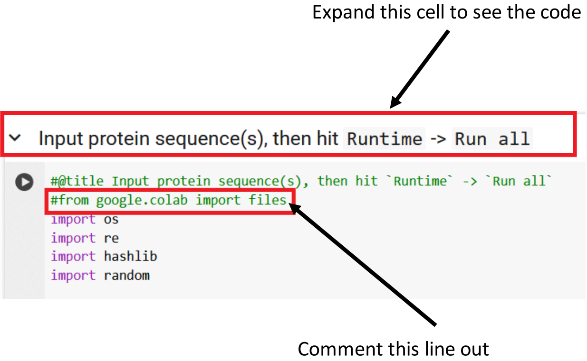
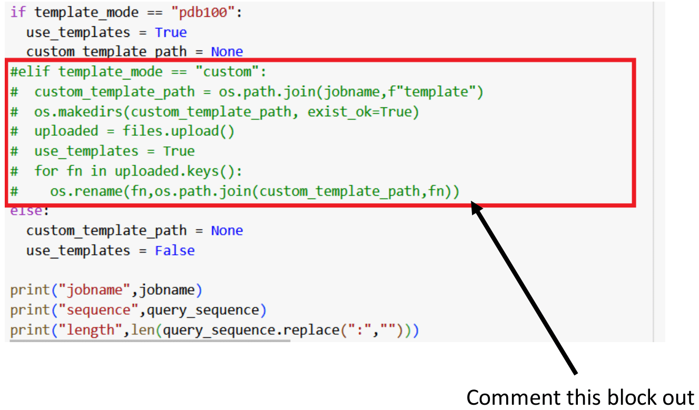

## Steps for running ColabFold on Local Jupyter Notebook
<!-- links for further reading and testing
google colab : https://colab.research.google.com/#scrollTo=Wf5KrEb6vrkR
hpc implementation for colabfold which hopefully could be adapted : https://www.jameslingford.com/blog/colabfold-hpc-ssh-howto/  ## the focus should be on this link now.

This was tested on Windows Subsytem for Linux (WSL2). Large part of the instructions has been adopted from [this blog here](https://www.exxactcorp.com/blog/molecular-dynamics/how-to-install-colabfold-run-ai-protein-folding-locally). Hopefully this would work on actual Linux Ubuntu 22.04 distro. **Note:** It ran on top of python 3.10 and **not** python 3.8. I had several package dependencies conflicts resultions when try setting up the environment with python 3.8.

## 1. Create and activate virtual environment
- First install Pyenv and virtualenv.

Install necessary ubuntu packages as follows:
```bash
    sudo apt install -y make build-essential libssl-dev zlib1g-dev \
          libbz2-dev libreadline-dev libsqlite3-dev wget curl llvm \
          libncursesw5-dev xz-utils tk-dev libxml2-dev libxmlsec1-dev \
          libffi-dev liblzma-dev git

```
Install pyenv:
```bash
    curl https://pyenv.run | bash

    # Update ~/.bashrc by adding the following lines
    export PYENV_ROOT="$HOME/.pyenv"
    export PATH="$PYENV_ROOT/bin:$PATH"
    eval "$(pyenv init - bash)"
    eval "$(pyenv virtualenv-init -)"

    # then
    source ~/.bashrc # or type 'bash'
```
Install Python 3.10 with pyenv
```bash
    pyenv install 3.10.14
    pyenv global 3.10.14

    # test your version
    python --version
```

Install virtualenv
```bash
    pip install virtualenv

    # alternative to pip use:
    sudo apt install python3-virtualenv # preferred

```
<!-- 

To install Jupyter Notebook within a virtual environment, first create and activate the virtual environment. Then, install Jupyter Notebook using pip install notebook. Finally, install the virtual environment as a Jupyter kernel using python -m ipykernel install --user --name=myvenv. 
Here's a more detailed breakdown:
1. Create and Activate the Virtual Environment:

    Create the virtual environment: virtualenv myvenv (replace myvenv with your desired environment name). 

Activate the environment: source myvenv/bin/activate (on Linux/macOS) or myvenv\Scripts\activate (on Windows). 
The command prompt will change to show the environment is active (e.g., (myvenv) $). 

2. Install Jupyter Notebook:

    Within the activated virtual environment, install Jupyter Notebook using pip: pip install notebook. 

3. Install and Register the Kernel:

    Install the IPython kernel: pip install ipykernel. 

Register the virtual environment as a Jupyter kernel: python -m ipykernel install --user --name=myvenv (replace myvenv with your environment name). 

4. Use Jupyter Notebook with the Virtual Environment:

    Start Jupyter Notebook: jupyter notebook. 

When creating a new notebook, you'll find the virtual environment listed as a kernel (e.g., "myvenv"). 
Select the kernel to use the packages installed within your virtual environment. 

5. Deactivate the Virtual Environment (When Done):

    To deactivate the virtual environment, use the deactivate command


Now create and activate virtual environment for colabfold assumed you run on '/home/username'
```bash
    # creating environment
    virtualenv -p $(pyenv which python) colabfold_env

    # activating environment
    source colabfold_env/bin/activate

```

- Download the modified version of ColabFold from the [fork provided by Rive Sunder](https://github.com/rivesunder/ColabFold)

-->

Objective:

- Setting up a local runtime for running ColabFold job using personal GPU resources (Running )
- Testing to run prediction

The steps below worked well over WSL2 but not tested on native Ubuntu Linux machine.

### Steps

1. Create an isolated environment for colabfold

```bash

mamba create -n colabfold-web
mamba activate colabfold-web
```

2. Install key library dependencies on the environment

```bash

mamba install tensorflow libclang setuptools dm-haiku

```

3. Install jupyter notebook and google-colab

```bash

mamba install jupyter google-colab
```

4. Spin up local notebook server instance by running the following command

```bash

jupyter notebook --NotebookApp.allow_origin='https://colab.research.google.com' --port=8080 --NotebookApp.port_retries=0
```

When server started to run, copy the token from the screen outputs after the above `jupyter notebook command`. The token typically looks like: `http://localhost:8080/tree?token=de5e760521a849f949f5cfcc971d2e5d2412c8a64e1ae553`.

5. In the ColabFold notebook, click on the small downwards pointing arrow in the top-right corner (just below the settings symbol). Click it and select “Connect to a local runtime” in the dropdown menu. A “local connection settings” window will pop-up with an empty field where you can paste in your jupyter token above.

To run prediction, you might need to disable codes for uploading custom pdb templates in the google colab notebook in your browser as this may lead up to `ModuleNotFound (google.colab)` error. More on this see this [issue](https://github.com/cambiotraining/protein-structure-prediction/issues/1#issue-3235397784).

The images below illustrate how to disable the codes for custom templates upload which caused the issue above.






## Reference:
James LingFord (2023), How to run the ColabFold notebook on a HPC over SSH. https://www.jameslingford.com/blog/colabfold-hpc-ssh-howto/
